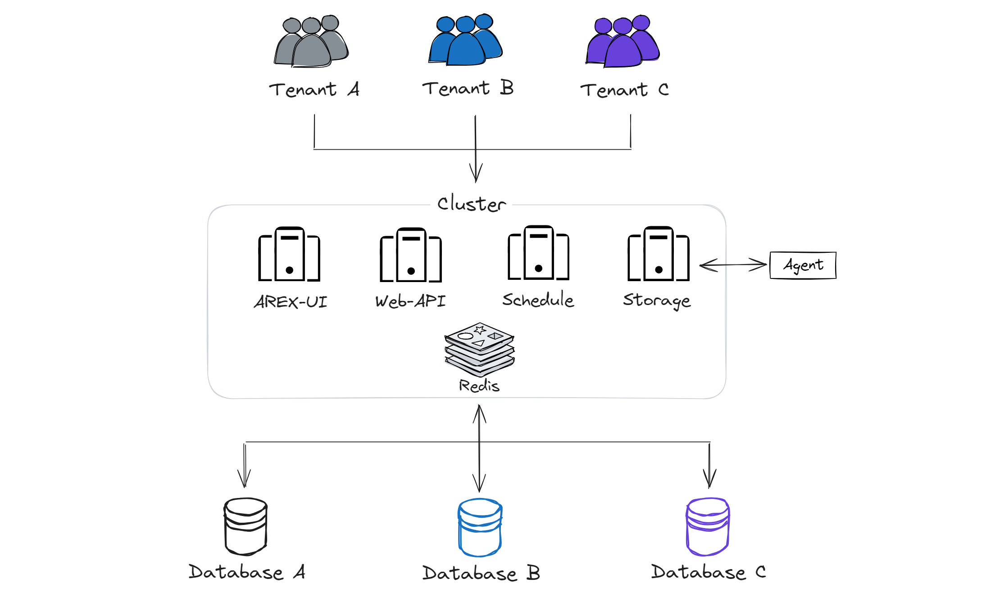
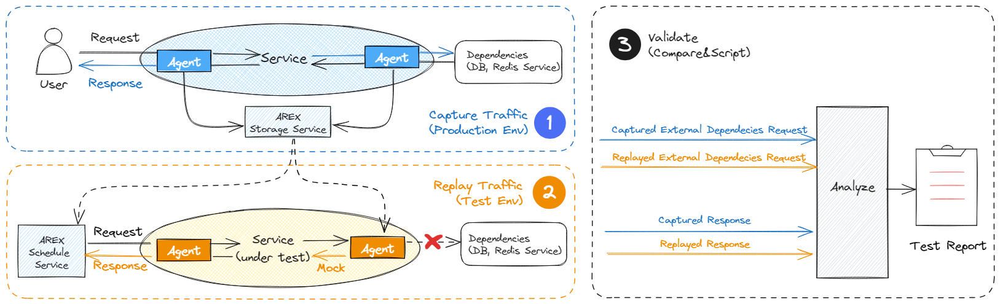

Softprobe 是一个开源的基于真实请求与数据的流量回放测试平台，通过录制线上真实流量到测试环境回放实现自动化测试。

Softprobe Cloud 是基于 Softprobe 的 SaaS 解决方案，通过云端提供服务，无需用户手动部署服务组件，即开即用，极简运维和管理。

## 核心特色

Softprobe Cloud 继承了 Softprobe 的核心优势：

**✔ 低成本**
- 无代码侵入，基本无接入成本  
- 无需编写测试用例，海量的线上请求也能保证高覆盖率

**✔ 多样性支持**

支持写验证，支持数据库、消息队列、Redis 数据的验证，甚至支持验证运行时的内存数据，并且测试时不会产生脏数据。

**✔ 测试用例运行稳定**

支持各种主流技术框架的自动数据采集和 Mock，并且支持了本地时间、缓存，在回放时精准还原生产执行时的数据环境。

**✔ 安全稳定**

在数据安全方面，提供完备的权限管控、流量脱敏等机制。代码隔离，并实现健康管理，在系统繁忙时会智能降低或关闭数据采集频率，不影响线上应用。

并且在开源版本的基础上，还具备以下额外优势：

**✔ 开箱即用**

通过云端提供服务，无需用户部署运维，即开即用，轻量化运营。

**✔ 维护简便**

维护和升级工作由服务提供商负责，用户无需担心软件更新和系统维护问题。

**✔ 专业技术支持**

由专业运维团队提供技术保障，在使用过程中遇到任何问题，可以获得及时的技术帮助和故障维护等 SLA 服务。

## 产品架构

## 工作流程

**1. 流量录制：**

  - Softprobe Java Agent 在生产环境中搭载在 Java 应用上，录制数据流量和请求信息。
  - 将录制到的信息发送到 Softprobe 数据存取服务（Storage Service）。
  - 数据存取服务将信息导入 MongoDB 数据库中进行存储。

**2. 流量回放：**

  - 调度服务向目标验证服务发送接口请求，模拟生产环境中的行为。
  - 测试环境中的被测应用同样搭载 Softprobe Java Agent，当被测应用需要对外部依赖进行调用时，Agent 会将录制的外部依赖（外部请求/DB）的响应返回给被测应用，避免了对实际数据库或其他依赖的交互，减少对特定环境数据的依赖，专注于验证程序本身的逻辑和功能。
  - 目标服务处理请求逻辑，并返回响应报文。

**3. 结果验证与报告：**

  - 调度服务分别对录制和回放的**主接口响应报文**与**子调用的入参**进行对比，验证系统逻辑的正确性。
  - 比对结果分析后生成回放报告。
  - 测试人员检查回放报告，评估应用的功能和性能。
