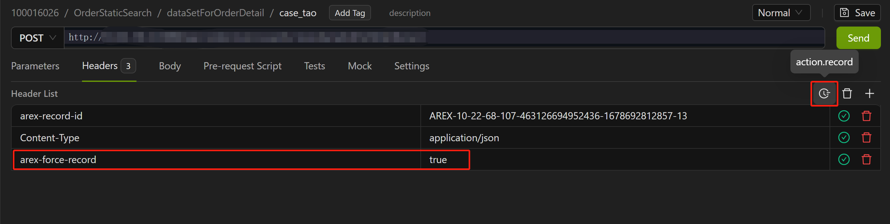
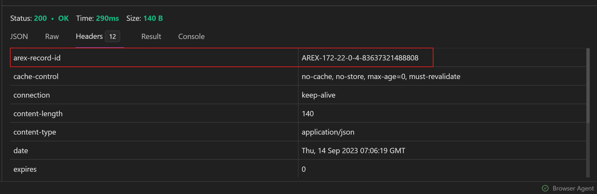
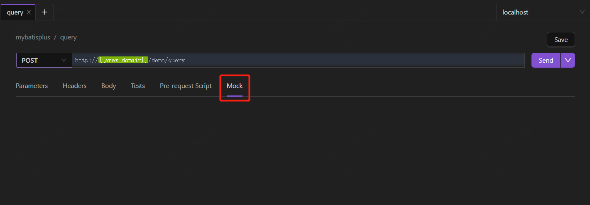
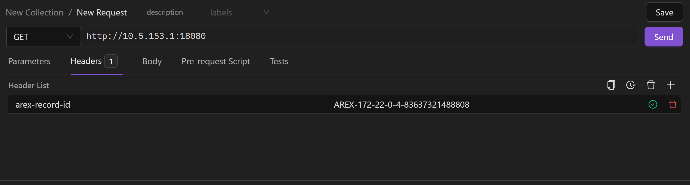
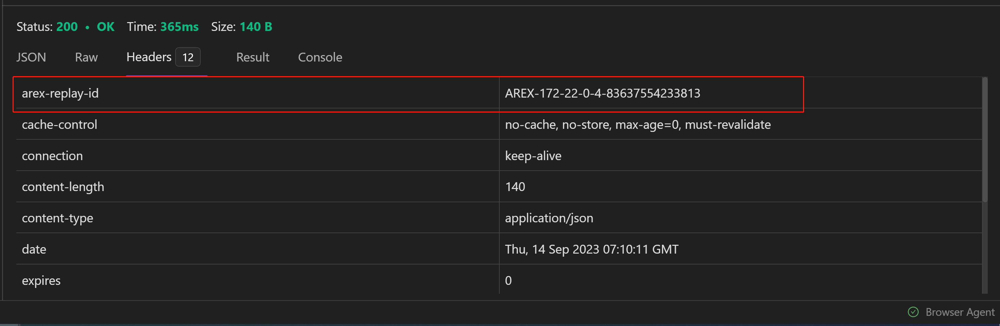

import { Callout } from 'fumadocs-ui/components/callout';

Mock 的本质在于模拟三方业务接口的返回结果，来满足自身的测试功能，快速完成测试任务。

利用 Softprobe，你可以通过强制录制一条线上真实的请求，并在测试环境中进行回放验证系统正确性。借助 Softprobe 强大的 Mock 机制，录制过程中 Softprobe 将自动对该条真实请求所有的外部依赖进行 Mock，帮你在本地完美还原线上生产数据环境，解决回归测试中**数据构造难、测试用例编写难**的难题。

<Callout title="提示">只有部署了 Softprobe Agent 的服务接口才能进行强制录制的操作。</Callout>

### 使用场景

- **线上问题快速本地复现**：如果你需要有针对性的对生产环境里某个出现问题的请求进行 Debug，可以将该条请求通过 Softprobe Record 进行强制录制，之后在本地再次执行该条请求进行 Debug，由于录制过程中 Softprobe 会将所有依赖的数据都进行采集和 Mock，本地数据环境与生产环境基本无异，因此可以保证本地快速复现。
- **新功能测试**：你也可以以相同的方式录制一个线上请求，在返回的 Mock 数据中进行相应修改以满足新功能，利用 Softprobe 可以自动 Mock 这条请求依赖的数据，不用再手动构造数据，非常方便。

## 第一步：录制单个请求 

1. 新建一个快捷请求，将需要录制的用例的请求报文依次填入，包含请求行（请求方式和请求地址）、请求头及请求体。

2. 点击 `action.record` 图标，在请求 Header 中添加 Key: Softprobe-force-record，Value: true，点击 Send 发送录制请求。

    

3. 点击 **Send** 后，在返回报文的 **Header** 中会生成 Record ID，Key:Softprobe-record-id，Value:录制 ID。 

    

4. 点击 **Save**，保存强制录制的结果。

## 第二步：编辑 Mock 数据

点击新增的 **Mock**，里面是 Softprobe 录制过程中的所有依赖的数据。左侧是 Mock 到的主接口及外部调用的请求报文，右侧是对应的响应报文。

Softprobe 支持对 Mock 数据的编辑修改。比如你需要验证本地环境下开发的新功能，如果对 Mock 的数据不满意，则可以手动修改以满足新功能的需求，点击 **Save** 保存，之后便可以在测试环境对新功能接口进行请求，这时就可以通过修改后的 Mock 数据以验证新功能的正确性。

<Callout title="注意">无法对主接口的返回值进行修改，因为主接口的返回值是不 Mock 的，Softprobe 只会对中间过程中调用的第三方依赖进行 Mock，修改才有效。</Callout>

## 第三步：本地回放

1. 新建一个请求，填写本地环境/测试环境中需要测试的接口地址。

2. 在请求 Header 中添加 Key: Softprobe-record-id，Value: 先前得到的录制 ID。
    
    

3. 点击 **Send** 发送请求，完成本地回放，返回报文的 Header 中会生成 Replay ID，Key:Softprobe-replay-id，Value:回放 ID。现在可以正常进行 Debug 操作。

    
