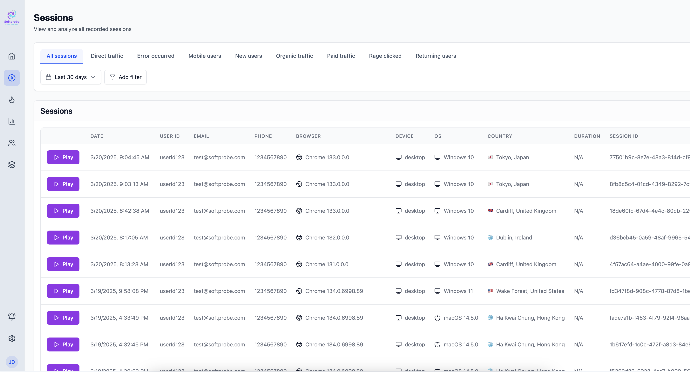
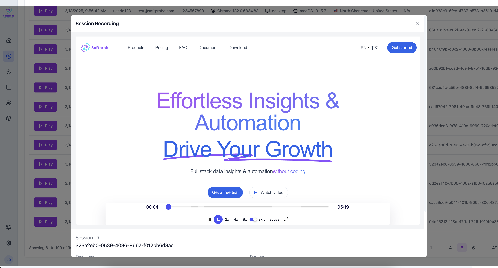
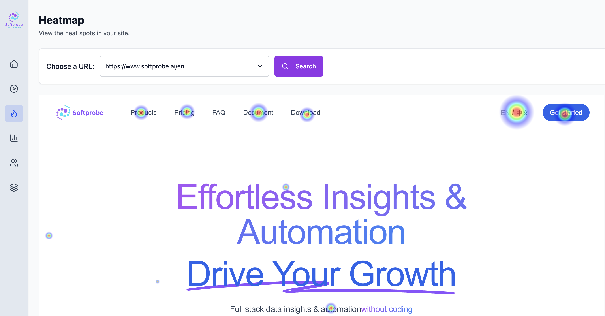

Let's quickly start install our SDK in 5 minutes.

## Step 1: Install SDK  

Install via npm (or use CDN script):  
```bash
npm install @softprobe/softprobe-web-record-sdk --save
```

## Step 2: Initialize Configuration  

Add initialization code to your project entry file (e.g., `main.js`/`app.js`):  

```javascript
// Asynchronously load SDK to optimize first-screen performance
const initializeAnalytics = async () => {
  try {
    const { default: initSoftprobe } = await import('@softprobe/softprobe-web-record-sdk');
    initSoftprobe({
      appId: 'appId-softprobe-test-page', // Replace with your application ID
      tenantId: 'tenant-softprobe-test-user',         // Replace with your tenant ID
      tags: { 
        userRole: 'guest',                 // Custom tags (optional, for categorical search)
      },
      privacy: {
        maskSelectors: ['.credit-card', '#password'] // DOM elements to mask
      }
    });
  } catch (error) {
    console.error('Softprobe initialization failed:', error);
  }
};

initializeAnalytics();
```

## Step 3: View Replays & Analytics  

**Access Management Dashboard**  
- Log in to the [Softprobe Dashboard](https://dashboard.softprobe.ai/) using your credentials or SSO.  

**Select Session Tab**  
- Choose the corresponding organization and application from the left navigation pane, then navigate to "Session Tab".  



**Analyze User Sessions**  
- Go to the **Session Replay panel** to filter sessions by time, device type, tags, etc.  
- Click any session to replay operational workflows in real-time, inspect event timelines, and view associated metadata (click coordinates, scroll depth).  



**Generate Analytics Reports**  
- Visit the [Analytics Center](https://dashboard.softprobe.ai/heatmap) to:  
  - Export heatmaps and conversion funnel reports.  
  - Configure automated alert rules (e.g., "Trigger notification when page exit rate > 60%").  


