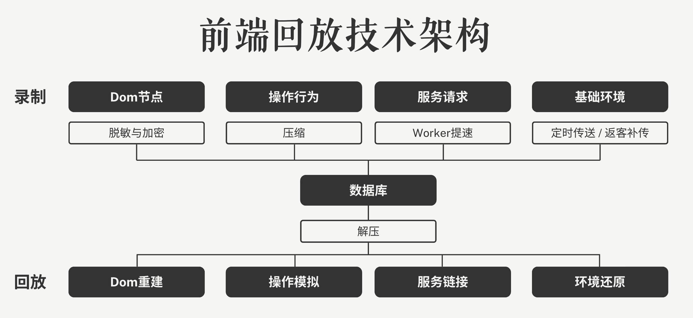

Softprobe的前端回放是一款轻量级的前端用户行为分析工具，专注于通过非录屏技术实现用户操作的可视化回放与深度数据分析。

它通过采集页面结构、用户交互行为（如点击、滑动、路由跳转）等日志信息，在回放时动态重建页面并模拟操作流程，形成类视频流体验。

同时提供数据加密、隐私保护及商业分析能力，帮助企业高效理解用户行为，优化产品体验。

## 核心功能亮点

Softprobe前端页面回放可以使用无代码接入给你带来像素级的还原效果。

**✔ 超低性能消耗，无感采集**

- 非传统录屏技术：通过日志记录用户操作与页面结构，而非录制视频流，减少对用户设备性能和网络带宽的占用。
- 轻量级SDK：前端套件体积小于30KB，支持按需加载，确保网页加载速度不受影响。

**✔ 极简接入，5分钟完成集成**

- 仅需引用SDK并初始化配置，无需复杂开发或重构代码，适配主流前端框架（React/Vue/Angular等）

**✔  隐私合规与数据安全**

- 敏感信息掩码：自动或手动遮挡用户输入（如密码、银行卡号），确保隐私字段不存储、不回放。
- 端到端加密：数据在传输与存储时均采用双向加密，符合GDPR、CCPA等法规要求。

**✔ 逼真回放体验**

- 像素级重构：基于操作日志重建页面历史状态，还原展示给用户的每一个细节。
- 无视版本迭代：记录基于当时页面的DOM结构记录，不会因为产品的需求更新迭代而还原不准。
- 模拟操作：模拟真实用户操作轨迹，支持倍速播放、关键节点跳转和操作事件标记。

**✔ 精准用户行为洞察**

- 热力图分析：识别页面点击热点与空白区域，优化UI布局。
- 异常行为检测：自动标记“愤怒点击”（高频无效操作）、页面卡顿等异常场景，定位用户体验瓶颈。
- 转化路径追踪：分析用户从访问到转化的关键路径，提升业务转化率。

## 项目架构

