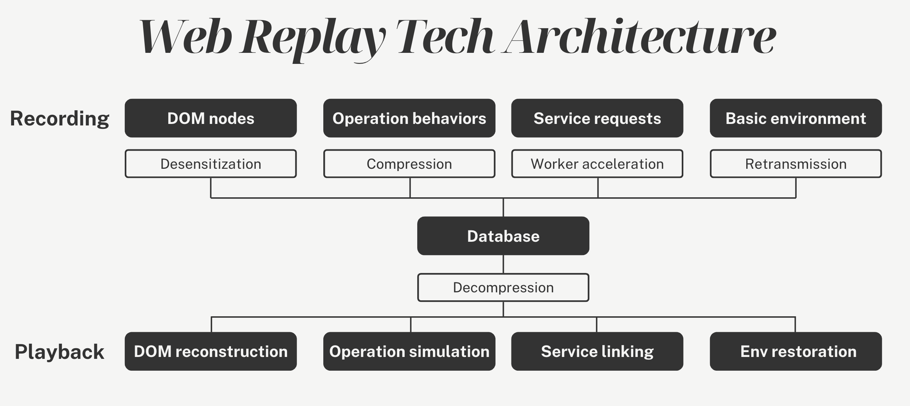

**Softprobe Frontend Session Replay** is a lightweight user behavior analytics tool designed to visualize user interactions and enable deep data analysis through a **non-screen-recording approach**.  

By capturing page structures, user interactions (clicks, scrolls, route navigation), and behavioral logs, it dynamically reconstructs pages and simulates user workflows during replay, delivering a **video-like playback experience**.  

The solution also provides robust data encryption, privacy protection, and business analytics capabilities, empowering enterprises to efficiently analyze user behavior and optimize product experiences.  

## Core Features  

Softprobe's frontend session replay delivers **pixel-perfect reproduction** with no-code integration.  

**✔ Ultra-Low Performance Impact**

- **Non-recording technology**: Logs user interactions and page structures instead of capturing video streams, minimizing performance overhead on user devices and network bandwidth.

- **Lightweight SDK**: The frontend package size is less than 30KB, supports on-demand loading, and ensures negligible impact on page load speed.

**✔ Seamless Integration in 5 Minutes**

- Simple SDK initialization requiring no complex development or code refactoring. Compatible with major frontend frameworks (React, Vue, Angular, etc.).

**✔ Privacy Compliance & Data Security**

- **Sensitive data masking**: Automatically or manually obscures user inputs (passwords, credit card numbers) to prevent storage or replay of private fields.
- **End-to-end encryption**: Data is encrypted in transit and at rest using AES-256, complying with GDPR, CCPA, and other regulatory requirements.

**✔ Realistic Playback Experience**

- **Pixel-perfect reconstruction**: Rebuilds historical page states from interaction logs, reproducing every user-facing detail.
- **Version-agnostic replay**: Records DOM structures as they existed during sessions, ensuring accurate playback regardless of subsequent product updates.
- **Behavior simulation**: Replicates real user interaction paths with support for variable playback speeds, key event navigation, and operation tagging.

**✔ Actionable User Behavior Insights**

- **Heatmap analysis**: Identifies click hotspots and dead zones to optimize UI layouts.
- **Anomaly detection**: Automatically flags rage clicks (high-frequency invalid actions) and page freezes to pinpoint UX bottlenecks.
- **Conversion path tracking**: Analyzes critical user journeys from entry to conversion to boost business metrics.

## System Architecture

