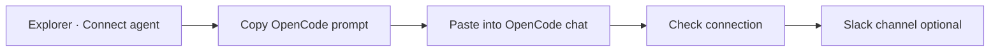

# Quick start

Connect an OpenCode agent to Softprobe Agent QA from Explorer, verify the first Session, then optionally attach Slack.

## Flow

## 1. Open Connect agent

In Softprobe Explorer, open **Agents** and click **+ Connect agent**. Name the Agent and choose an environment. Softprobe mints a per-agent API key (`spk_…`) used only for that Agent’s capture.

## 2. Paste the install prompt into OpenCode

Copy the short install prompt from the modal and paste it into an OpenCode chat. The prompt tells OpenCode to:

1. Merge OpenTelemetry + `@softprobe/opencode-plugin@latest` into `opencode.json` or `opencode.jsonc` (project or `~/.config/opencode`)
2. Write Softprobe credentials to `~/.config/opencode/opencode-softprobe.json` with:
   - `publicKey` = your **agent** API key (`spk_…`)
   - `baseUrl` = `https://explorer.softprobe.ai/api/thelake`
   - `otlpEndpoint` = `https://explorer.softprobe.ai/api/thelake/v1/traces`
3. Restart and run one real chat turn

::: warning Do not point OpenCode at thelake directly
Use the Explorer gateway URLs above. `https://thelake.softprobe.ai` and shared smoke tokens will not work for Agent QA connect.
:::

Full details: [OpenCode install](/en/agent-qa/opencode). Official OpenCode references: [Config](https://opencode.ai/docs/config/), [Plugins](https://opencode.ai/docs/plugins/).

## 3. Verify capture

After one real OpenCode turn, click **Check connection** in Explorer. When verification succeeds, continue to Slack.

Open **Sessions** to browse captures. Use the range control (default last 7 days, rolling) and the Agent filter; both update the address bar so the view is shareable.

## 4. Slack last (optional)

Choose a Slack channel for Findings, or **Skip for now**. Workspace OAuth stays under **Integrations**; this step only attaches a channel to the Agent.

## Next

- [OpenCode install reference](/en/agent-qa/opencode)
- [Concepts](/en/agent-qa/concepts)
