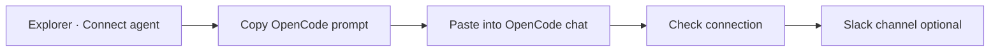

# Quick start

Connect an OpenCode agent to Softprobe Agent QA from Explorer, verify the first Session, then optionally attach Slack.

## Flow

## 1. Open Connect agent

In Softprobe Explorer, open **Agents** and click **+ Connect agent**.

## 2. Paste the install prompt into OpenCode

Copy the short install prompt from the modal and paste it into an OpenCode chat. The prompt tells OpenCode to:

1. Enable OpenTelemetry and add `@softprobe/opencode-plugin@latest`
2. Write credentials to `~/.config/opencode/opencode-softprobe.json`
3. Restart and run one real chat turn

Full details: [OpenCode install](/en/agent-qa/opencode).

## 3. Verify capture

After one real OpenCode turn, click **Check connection** in Explorer. When verification succeeds, continue to Slack.

## 4. Slack last (optional)

Choose a Slack channel for Findings, or **Skip for now**. Workspace OAuth stays under **Integrations**; this step only attaches a channel to the Agent.

## Next

- [OpenCode install reference](/en/agent-qa/opencode)
- [Concepts](/en/agent-qa/concepts)
