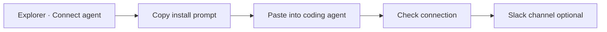

# Quick start

Connect an agent to Softprobe Agent QA from Explorer, verify the first Session, then optionally attach Slack. Choose **OpenCode** or **LangChain** in the Connect agent flow.

## Flow

## 1. Open Connect agent

In Softprobe Explorer, open **Agents** and click **+ Connect agent**. Name the Agent, choose an environment, and select the framework (**OpenCode** or **LangChain**). Softprobe mints a per-agent API key (`spk_…`) used for that Agent’s capture.

## 2. Paste the install prompt

Copy the short install prompt from the modal and paste it into your coding agent:

| Framework | Where to paste | What it does |
|-----------|----------------|--------------|
| **OpenCode** | An OpenCode chat | Merges `@softprobe/opencode-plugin`, writes credentials, one real turn |
| **LangChain** | Cursor / Codex / Claude Code | Installs Softprobe packages, sets env, attaches `CallbackHandler` |

Full details: [OpenCode install](/en/agent-qa/opencode), [LangChain install](/en/agent-qa/langchain).

## 3. Verify capture

After one real agent turn (prefer a turn that uses a **tool** for LangChain), click **Check connection** in Explorer. When verification succeeds, continue to Slack.

Open **Sessions** to browse captures. Use the range control (default last 7 days, rolling) and the Agent filter; both update the address bar so the view is shareable.

## 4. Slack last (optional)

Choose a Slack channel for Findings, or **Skip for now**. Workspace OAuth stays under **Integrations**; this step only attaches a channel to the Agent.

## Next

- [OpenCode install reference](/en/agent-qa/opencode)
- [LangChain install reference](/en/agent-qa/langchain)
- [Concepts](/en/agent-qa/concepts)
