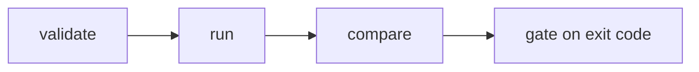

# For AI agents — overview

Agent Evaluation docs describe how coding agents and CI scripts **author, run, compare, and gate** agent benchmarks through **`sp eval`** with stable `--json` output.

## When to use eval vs Testing

| Use | Product |
|-----|---------|
| Record/replay regression on Java services | [Testing](/en/testing/) |
| Evaluate **your** LLM agents (routing, tools, outcomes) | **Agent Evaluation** |
| Istio/session business observability | [Platform](/en/platform/) |

## Agent workflow



1. **Validate** — `sp eval validate --import promptfoo` before model spend
2. **Run** — `sp eval run --manifest … --json --out-dir …`
3. **Compare** — `sp eval compare --baseline … --candidate …` on PRs
4. **Gate** — branch on exit code and `gate` field in JSON envelope

## Key contracts

- [Output contract](/en/evaluation/agents/output-contract) — JSON envelope and artifacts
- [CLI reference](/en/evaluation/reference/cli)
- [Result status](/en/evaluation/reference/result-status) — never treat errors as score 0
- [Framework adapters](/en/evaluation/reference/framework-adapters)

## Eval depth

| Mode | Guide |
|------|-------|
| Prompt-only (output checks) | [Eval modes](/en/evaluation/guides/eval-modes) |
| Environment-backed (oracles) | Same guide |

## Mental model (one line)

```text
Suite (pinned recipe) → Run → Evidence → Measurements → Gates
```

Full walkthrough: [Mental model](/en/evaluation/mental-model).

## llms.txt

This site exposes `/llms.txt` and per-page `.md` endpoints for agent consumption (same as Testing docs).
