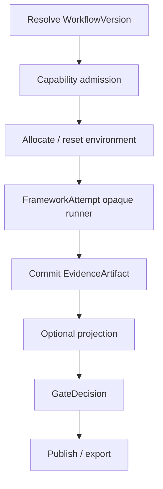
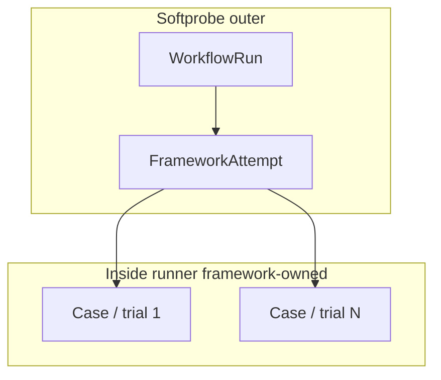
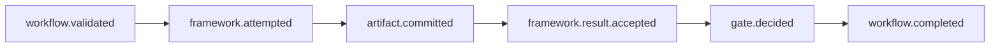

# Execution DAG

Softprobe plans a **content-addressed outer DAG** around one opaque **framework runner** node — not a Softprobe-owned “cases → Softprobe evaluators → Softprobe reducers” loop.

## Outer DAG

```text
resolve WorkflowVersion → admit capabilities → allocate environment
 → FrameworkAttempt (opaque runner) → commit EvidenceArtifact
 → optional score projection → GateDecision → publish/export
```



Inside the runner, the framework may expand cases, run trials, invoke judges, and write its own reports. Softprobe does **not** model those as Softprobe DAG nodes.

## Parallelism



Softprobe may run multiple WorkflowRuns concurrently (budgets permitting). Framework-internal parallelism stays inside the runner process.

## Node identity

Outer nodes are content-addressed where practical: WorkflowVersion digest, runner digest, environment digest, seed/fingerprint when declared.

Framework runners are **non-cacheable by default** unless a future runner contract proves a lossless finer-grained projection.

## Cache policy

| Node kind | Default cache |
|-----------|---------------|
| Pure hermetic Softprobe control checks | Eligible |
| Opaque framework runner | Non-cacheable (default) |
| Live / human / side-effecting | Non-cacheable |

## Events per stage

Outer stages emit typed events. Canonical names live in [Events](/en/evaluation/reference/events):


