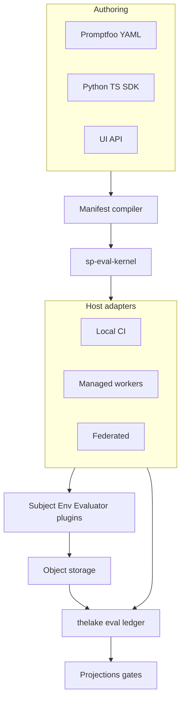

# Architecture overview

Softprobe Agent Evaluation is **Design 3: the portable evaluation kernel** — one Rust `sp-eval-kernel`, one semantic model, many runtimes (local, CI, managed, federated).

## Components

| Component | Role |
|-----------|------|
| **Public API** | `data + subject + evaluators + environment` — resource CRUD, run, query, compare, promote |
| **Manifest compiler** | Resolve names → digests; import Promptfoo/DeepEval with loss diagnostics |
| **sp-eval-kernel** | Validate, plan DAG, state machine, IDs, retries, events — single Rust binary |
| **Host adapters** | Launch processes, transfer bytes, clocks, secrets — no orchestration semantics |
| **Plugins** | Subject, Environment, Evaluator, Generator, Reducer, Gate |
| **thelake ledger** | Append-only SoR: manifests, events, attempts, measurements |
| **Object storage** | Content-addressed artifact bytes (tenant-scoped) |
| **Projections** | Scores, run views — async, rebuildable |

## What the kernel owns exclusively

- Manifest validation and capability negotiation
- DAG construction and node identity
- Legal state transitions and retry classification
- Attempt/result identity and cache eligibility
- Event schemas and terminal run calculation

Hosts may not synthesize these decisions.

## Related pages

- [Kernel and hosts](/en/evaluation/architecture/kernel-and-hosts)
- [Execution DAG](/en/evaluation/architecture/execution-dag)
- [Plugin model](/en/evaluation/architecture/plugin-model)
- [Storage and thelake](/en/evaluation/architecture/storage-and-thelake)
- [Trust boundaries](/en/evaluation/architecture/trust-boundaries)
