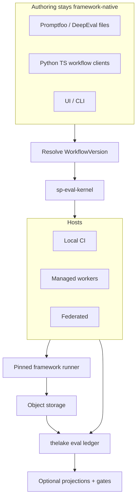

# Architecture overview

Softprobe Agent Evaluation is **Design 3: the portable evaluation kernel** — one Rust `sp-eval-kernel`, one **workflow** model, many runtimes (local, CI, managed, federated). Frameworks keep their DSLs; Softprobe supplies environment, lifecycle, evidence, thelake storage, comparison, and gates.

## Components

| Component | Role |
|-----------|------|
| **Public API** | `framework suite + subject + environment + runner` — pack, validate, run, query, compare, promote |
| **Workflow resolve** | Names → digests: FrameworkDefinition, RunnerVersion, SubjectVersion, EnvironmentVersion, gate policy |
| **sp-eval-kernel** | Validate, plan outer attempt, state machine, IDs, retries, events — single Rust binary |
| **Hosts** | Launch processes, transfer bytes, clocks, secrets — no orchestration semantics |
| **Framework runner** | Opaque execution node for Promptfoo/DeepEval/… |
| **thelake ledger** | Append-only SoR: WorkflowRun, FrameworkAttempt, EvidenceArtifact digests, GateDecision |
| **Object storage** | Content-addressed artifact bytes (tenant-scoped) |
| **Projections** | Optional scores / run views — async, rebuildable, loss-aware |

## What the kernel owns exclusively

- WorkflowVersion validation and capability negotiation
- Outer FrameworkAttempt identity, retries, cancellation, idempotency
- Legal state transitions and typed terminal outcomes
- Evidence commit-before-reference and event schemas
- GateDecision over outer status + selected runner-reported fields

Hosts and runners may not synthesize Softprobe lifecycle events or authoritative gates.

## What Softprobe does **not** own

- Case/assertion/scorer/reducer DSLs
- Softprobe-native suite authoring as a product surface
- A 1:1 importer that mirrors every framework feature

## Related pages

- [Kernel and hosts](/en/evaluation/architecture/kernel-and-hosts)
- [Execution DAG](/en/evaluation/architecture/execution-dag)
- [Extension model](/en/evaluation/architecture/plugin-model)
- [Storage and thelake](/en/evaluation/architecture/storage-and-thelake)
- [Trust boundaries](/en/evaluation/architecture/trust-boundaries)
