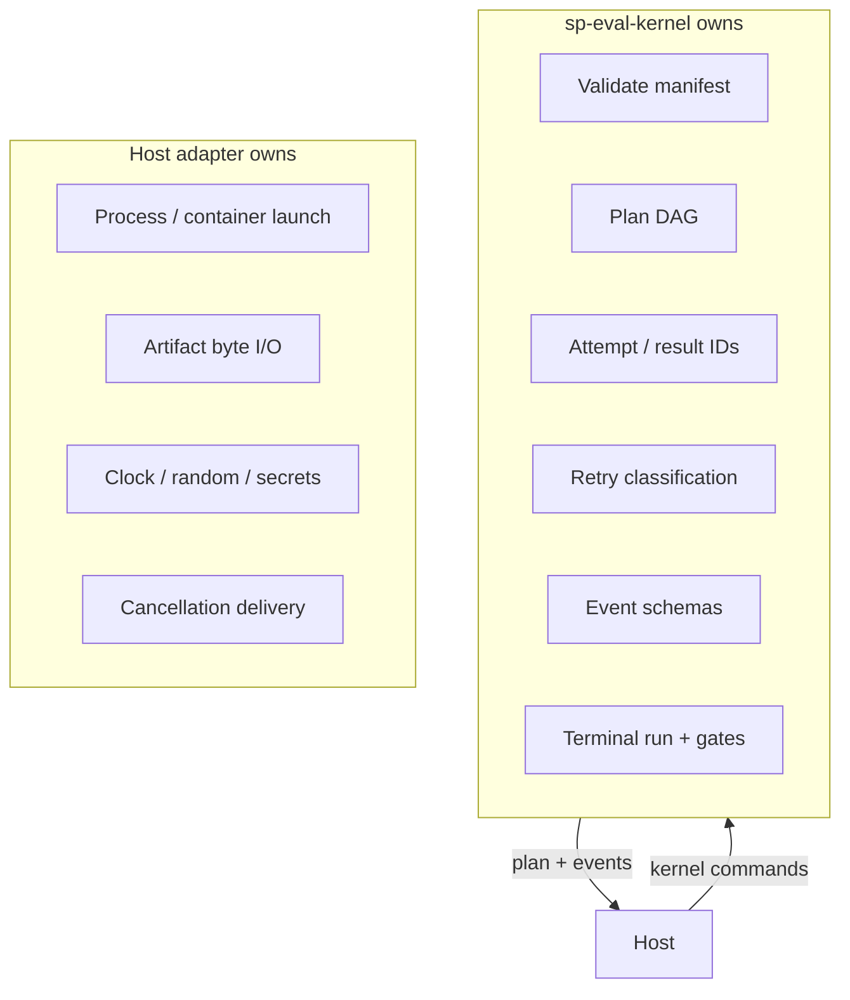
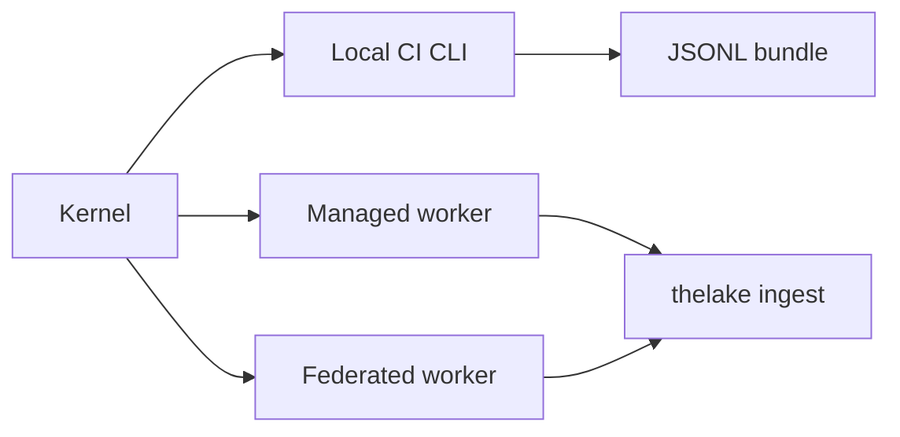

# Kernel and hosts

One **sp-eval-kernel** owns evaluation semantics. **Host adapters** supply execution primitives — they never synthesize orchestration decisions.

## Responsibility split

## sp-eval-kernel

One statically linked **Rust** binary implements validation, DAG planning, idempotent execution, state transitions, and event emission.

| Transport | Use |
|-----------|-----|
| stdin/stdout framed Protobuf | One-shot local/CI |
| Unix socket or gRPC | Long-lived managed/federated daemon |

Same crate, same semantics — verified by shared conformance corpus.

## Host adapters

| Host | Owns | Does not own |
|------|------|--------------|
| **Local/CI CLI** | Process launch, local CAS artifact dir, JUnit/Markdown reports | Manifest IDs, gate logic |
| **Managed worker** | Queues, sandboxes, quotas, tenancy, object storage upload | Whether retries are legal (asks kernel) |
| **Federated worker** | Private data residency, hardware placement | Authoritative state without signed ingestion |

Hosts feed every lease outcome back through kernel commands; they do not append raw events from public clients.

## SDK layers

| Layer | Audience |
|-------|----------|
| Public Python/TS SDK | Ergonomic manifest builders, REST clients |
| Internal host client | Framed Protobuf state-machine commands (trusted only) |

Public SDKs never export kernel event append or transition APIs.

## Distribution

`sp-eval-kernel` ships with Softprobe CLI releases: pinned protocol compatibility, checksum/signature, platform matrix (linux/darwin, amd64/arm64). Upgrade/downgrade refusal when manifest requires unsupported capabilities.

## Related

- [Trust boundaries](/en/evaluation/architecture/trust-boundaries)
- [Execution DAG](/en/evaluation/architecture/execution-dag)
