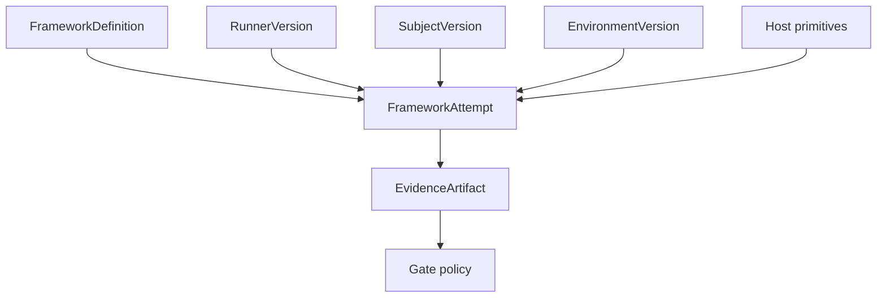
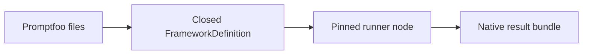

# Extension model

Softprobe extends through **versioned runners, environments, and host capabilities** — not a Softprobe-owned evaluator/scorer plugin marketplace.

(Older docs titled this “Plugin model.”)

## What you extend

| Extension | Softprobe role |
|-----------|----------------|
| **Framework runner** | Pin package/image/command; capture native result schema |
| **EnvironmentVersion** | Isolation topology and verify hooks the runner may use |
| **SubjectVersion** | What the framework exercises |
| **Host** | Process launch, CAS, secrets, clocks — no orchestration |
| **Gate policy** | Outer release view over status + selected fields |

## Capability descriptors (runners and environments)

Descriptors declare what a runner or environment **requires** so scheduling can reject incompatible WorkflowVersions before spending money:

- protocol / implementation version
- runtime: `oci`, `process`, …
- required mounts, network, secrets, GPU, budgets
- declared result-bundle schema / size limits
- determinism / reproducibility class
- data residency constraints

Unknown **required** capabilities → `unsupported` at validate/plan. Softprobe does **not** use descriptors to invent Softprobe scorers.

## Framework runners (not importers)

1. **Pack** — close and hash native files (no assertion translation).
2. **Run** — one opaque FrameworkAttempt.
3. **Optional projection** — loss-aware subset for `scores` queries.

## Control-plane checks (not evaluators)

Artifact integrity, secret redaction, capability admission, and release gates are **workflow policies**. They are not a Softprobe eval DSL and do not replace Promptfoo/DeepEval methods.

## Extension rule

Support a new evaluation method by shipping or pinning a **framework runner** that already owns it — not by adding Softprobe Measurement kinds or Softprobe reducers.

See [Capability descriptors](/en/evaluation/reference/capability-descriptors).
