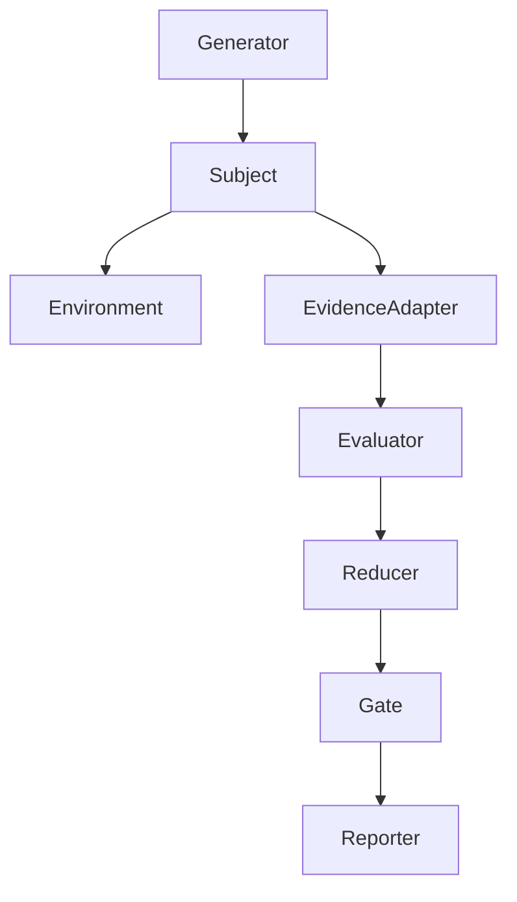
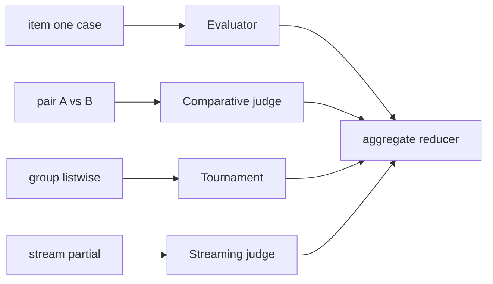
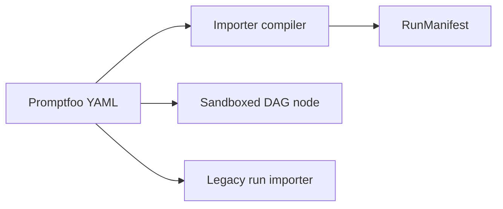

# Plugin model

Evaluators and environments extend the kernel through **capability descriptors** — not closed enum kinds.

## Plugin pipeline



## Plugin interfaces

```text
Generator.generate(seed, cases)     → derived cases + lineage
Subject.run(case, env, context)    → rollout + artifact refs
Environment.reset/step/observe/verify → state artifacts
EvidenceAdapter.materialize(selectors, snapshot) → evidence bundle
Evaluator.evaluate(bundle | group | stream) → measurements + status
Reducer.reduce(results, grouping, seed) → aggregates
Gate.decide(aggregates, baseline)  → decision + reasons
Reporter.consume(events)           → side effects (reports, webhooks)
```

## Evaluator execution topologies



## Evaluator descriptor fields

- protocol and implementation version
- runtime: `wasm`, `oci`, `process`, `remote`, `builtin`
- topology: `item`, `pair`, `group`, `stream`, `aggregate`
- required evidence selectors and accepted MIME/schema versions
- output measurement schema and target scopes
- determinism level, seed support, batchability, cache policy
- network, secret, filesystem, GPU, model, budget capabilities
- data residency and content-sensitivity constraints

Planning rejects incompatible descriptors before spending money.

## Framework adapters

Promptfoo/DeepEval integrate as:



1. **Importer** — YAML → manifest
2. **Sandboxed evaluator node** — one DAG invocation; no nested orchestration
3. **Opaque legacy importer** — whole run as non-cacheable external node

## Extension rule

New evaluation methods should ship as new scorer, reducer, generator, environment, or evidence adapter — **not** new core result types.

See [Capability descriptors](/en/evaluation/reference/capability-descriptors).
