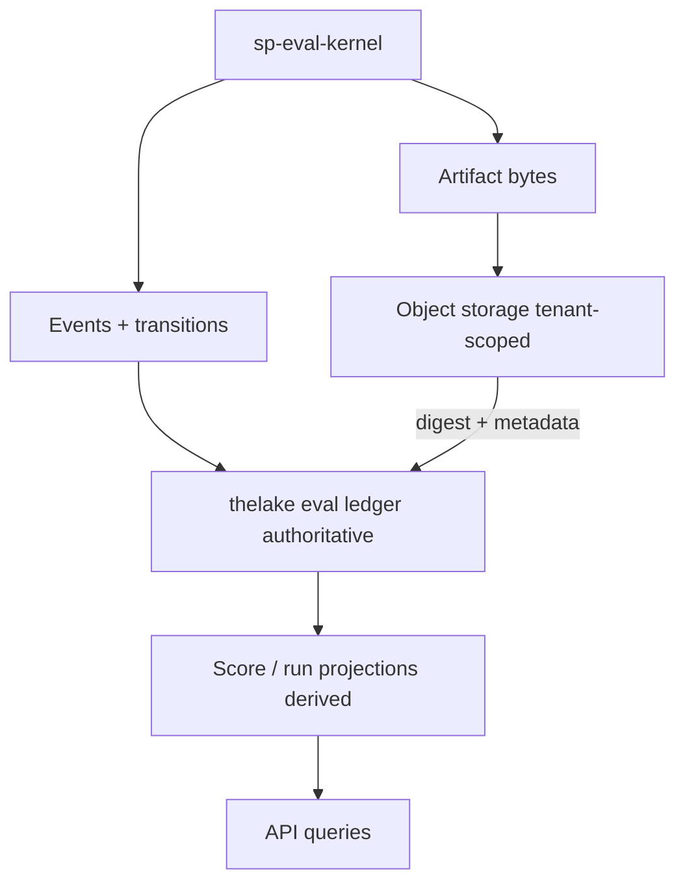
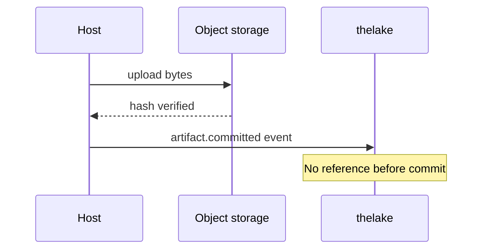
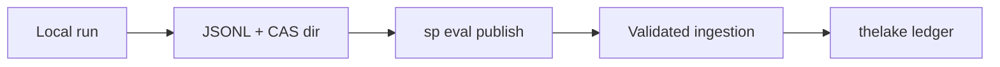

# Storage and thelake

Managed Agent Evaluation uses **thelake as the sole system of record** for eval domain data.

## Data flow

## Ledger (authoritative)

Append-only tables store:

- RunManifest snapshots
- Events and state transitions
- Attempts and typed failures
- Artifact metadata and content hashes
- Measurements, aggregates, gate decisions

The work **queue** is disposable coordination state — rebuildable from nonterminal ledger records.

## Object storage

Large immutable bytes live in tenant-scoped object storage. thelake stores digest, size, media type, encryption/ACL metadata, residency, retention class, and committed location.

**Commit-before-reference:** bytes upload and hash-verify before `artifact.committed` events reference them.

## Projections (derived)

Score/run-view projectors consume committed events asynchronously:

- Idempotent by event ID and logical measurement ID
- May lag behind ledger; cannot become source of truth
- Rebuildable from ledger + checkpoints

Existing **scores** table remains the query-friendly measurement projection, extended with score target v2.

## Local vs managed paths

Local runs write JSONL + CAS artifacts. **Publish** validates signatures, manifest identity, and artifact hashes before append through managed ingestion — distinct from arbitrary client event injection.

## Retention

Artifact bytes may expire per policy; tombstones and digests remain. Ledger events follow declared retention for audit.

## Related

- [Events reference](/en/evaluation/reference/events)
- [Score targets](/en/evaluation/reference/score-targets)
