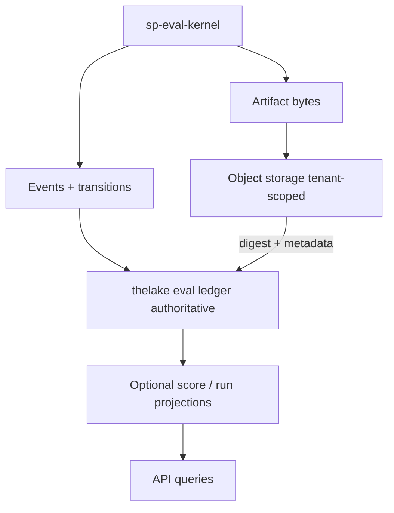
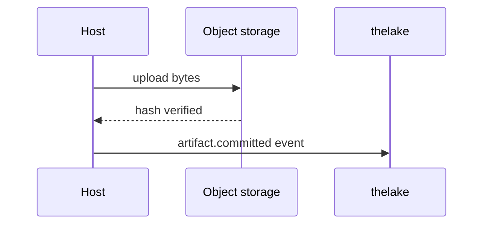

# Storage and thelake

Managed Agent Evaluation uses **thelake as the sole system of record** for Softprobe workflow domain data. Framework-native result detail remains in content-addressed **EvidenceArtifact** bytes.

## Data flow

## Ledger (authoritative)

Append-only tables store:

- WorkflowVersion snapshots
- Events and state transitions
- FrameworkAttempt records and typed failures
- Artifact metadata and content hashes
- GateDecision records
- Optional projected measurements (not a Softprobe evaluator contract)

The work **queue** is disposable coordination state — rebuildable from nonterminal ledger records.

## Object storage

Large immutable bytes live in tenant-scoped object storage (native result bundles, logs, traces). thelake stores digest, size, media type, encryption/ACL metadata, residency, retention class, and committed location.

Commit-before-reference: ledger never points at unverified bytes.

## Projections

Score and run views are **rebuildable** from the ledger + artifacts. They may lag and may be lossy relative to native bundles. Rebuild from events; do not treat projections as SoR.

## Related

- [Data model](/en/evaluation/concepts/data-model)
- [Events](/en/evaluation/reference/events)
- [Scores and gates](/en/evaluation/concepts/scores-and-gates)
