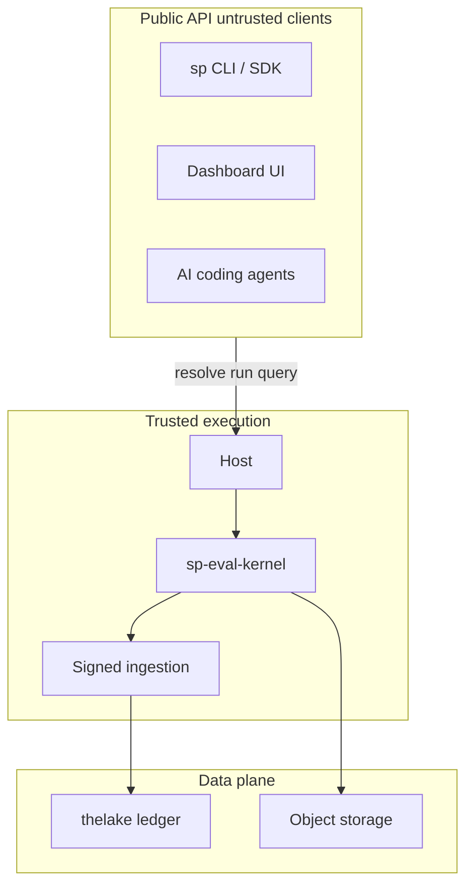
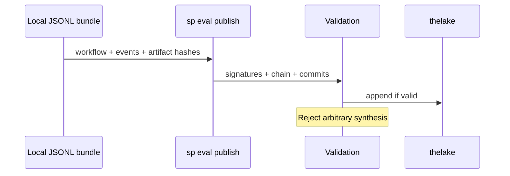

# Trust boundaries

Agent Evaluation separates **public clients** (your CI, SDK, agents) from **trusted kernel hosts** that alone produce authoritative Softprobe lifecycle events and GateDecisions.

## Trust zones

## Public API (untrusted clients)

Humans, SDKs, CLIs, UIs, and AI agents may:

- Pack / resolve FrameworkDefinition + WorkflowVersion
- Request/cancel WorkflowRuns
- Query/compare results and artifacts
- Propose framework-definition or policy changes (with policy)

They **cannot**:

- Append raw kernel events
- Invoke Softprobe state transitions directly
- Synthesize FrameworkAttempts, GateDecisions, or projected measurements

Trusted hosts emit lifecycle events after FrameworkAttempt (see [Events](/en/evaluation/reference/events)). The legacy `POST /api/v2/scores` path remains for non-eval telemetry and governed human-label ingest — not for fabricating Softprobe automated scores. See [REST API](/en/evaluation/reference/api).

## Trusted host ingestion (internal)

Accepts only kernel-produced envelopes bound to authenticated tenant, host, WorkflowVersion, and WorkflowRun identities. Validates signatures, sequence, idempotency, artifact commits, and protocol compatibility.

Illegal or skipped transitions are **rejected** — not repaired or reinterpreted.

## Local bundle publish

Publishing a local JSONL bundle is a validated import: WorkflowVersion identity, event chain, signatures, artifact hashes — not arbitrary event synthesis.

## Credential zones

| Zone | Holds |
|------|-------|
| Subject | Agent runtime credentials |
| Framework runner | Model/provider keys the runner declares |
| Control plane | Tenancy, ingestion, scheduling |

Sandboxes receive short-lived least-privilege handles — not shared raw secrets.

## Framework trust

Pinned **framework runners** (Promptfoo, DeepEval, …) run with explicit filesystem, network, and secret capabilities plus conformance/security tests. They cannot append Softprobe lifecycle events or publish authoritative gates.

Remote runners use tenant-bound signed requests, nonce/idempotency keys, expiry, and response signature verification.

## AI governance

Proposal, review, approval, publication, gate activation, and revocation are distinct authorized actions with immutable audit records. Self-approval and replayed approvals are rejected server-side.
