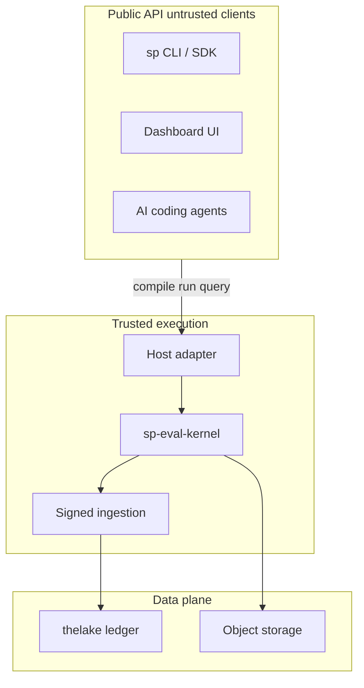

# Trust boundaries

Agent Evaluation separates **public clients** (your CI, SDK, agents) from **trusted kernel hosts** that alone produce authoritative events and measurements.

## Trust zones

## Public API (untrusted clients)

Humans, SDKs, CLIs, UIs, and AI agents may:

- Create/resolve suites
- Request/cancel runs
- Query/compare results
- Propose cases (with policy)

They **cannot**:

- Append raw kernel events
- Invoke state transitions directly
- Synthesize attempts or measurements

Eval **measurements** are kernel-produced during `evaluation.attempted`. The legacy `POST /api/v2/scores` path remains for non-eval telemetry and governed human-annotation ingest — not for fabricating automated eval scores. See [REST API](/en/evaluation/reference/api).

## Trusted host ingestion (internal)

Accepts only kernel-produced envelopes bound to authenticated tenant, host, manifest, and run identities. Validates signatures, sequence, idempotency, artifact commits, and protocol compatibility.

Illegal or skipped transitions are **rejected** — not repaired or reinterpreted.

## Local bundle publish

Publishing a local JSONL bundle is a validated import: manifest identity, event chain, signatures, artifact hashes — not arbitrary event synthesis.

## Credential zones

| Zone | Holds |
|------|-------|
| Subject | Agent runtime credentials |
| Evaluator | Model provider keys for judges |
| Control plane | Tenancy, ingestion, scheduling |

Sandboxes receive short-lived least-privilege handles — not shared raw secrets.

## Framework trust

External evaluators (Promptfoo node, remote webhook) run with explicit filesystem, network, and secret capabilities plus conformance/security tests.

Remote evaluators use tenant-bound signed requests, nonce/idempotency keys, expiry, and response signature verification.

## AI governance

Proposal, review, approval, publication, gate activation, and revocation are distinct authorized actions with immutable audit records. Self-approval and replayed approvals are rejected server-side.
