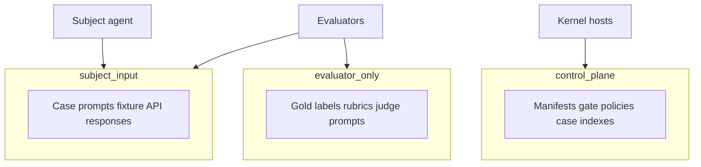

# Artifact visibility

Every artifact has a **visibility class** controlling which components may read it. Gold answers and control data never enter the subject namespace.

## Classes

| Class | Who reads | Examples |
|-------|-----------|----------|
| **subject_input** | Subject + evaluators (after run) | Case prompts, fixture API responses visible to agent |
| **evaluator_only** | Evaluators only | Gold labels, rubrics, prohibited-claim lists, judge prompts |
| **control_plane** | Kernel / trusted hosts only | Manifests, gate policies, sibling case indexes |

## Environment-backed eval

When running agents in sandbox fixtures:

- Expected outcomes and gold evidence stay in `evaluator_only`
- Subject sees sanitized fixture state only
- Subject attempts to read gold data, sibling cases, or result paths → typed policy failure + security test

## Audit

Evaluators declare readable classes; the kernel grants least privilege and audits granted/denied access per attempt.

## Commit-before-reference

Large bytes upload to object storage; ledger events reference digests only after hash verification. No event references pending blobs.

See [Storage and thelake](/en/evaluation/architecture/storage-and-thelake).
