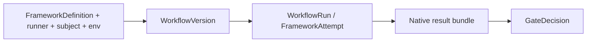
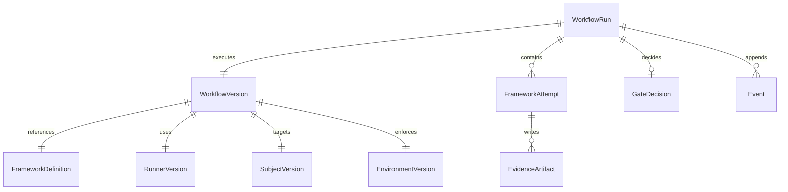

# Data model

Agent Evaluation separates **framework-native artifacts** from **Softprobe workflow records**. Softprobe does not model cases, assertions, scorers, or reducers — those remain inside the framework definition and result bundle.

## Core flow

```text
FrameworkDefinition + SubjectVersion + EnvironmentVersion + RunnerVersion
→ WorkflowVersion
→ framework runner (FrameworkAttempt)
→ native result bundle + EvidenceArtifact
→ Softprobe lifecycle + compare + GateDecision
```



## Layer A — Immutable resources (before execution)

| Entity | Description | Example |
|--------|-------------|---------|
| **FrameworkDefinition** | Closed, content-addressed native suite + dependencies | Promptfoo config/tests/prompts bundle digest |
| **RunnerVersion** | Framework name, package/lockfile/image digests, command, result-bundle schema, capabilities | `promptfoo-runner@2.1.0` + image sha |
| **SubjectVersion** | Code, image, model config, prompts, tools, or deployment under test | `support-agent@sha256:…` |
| **EnvironmentVersion** | Sandbox topology, mounts, secret refs, network policy, limits, time policy | network off, workspace ro |
| **WorkflowVersion** | Resolved FrameworkDefinition + RunnerVersion + SubjectVersion + EnvironmentVersion + gate policy | CI-pinned workflow digest |

## Layer B — Runtime records (during/after execution)

| Entity | Description |
|--------|-------------|
| **WorkflowRun** | One execution of one WorkflowVersion (outer lifecycle) |
| **FrameworkAttempt** | One runner invocation; framework-internal retries stay in the native bundle |
| **EvidenceArtifact** | Native definition, native result bundle, logs, traces, usage, environment evidence |
| **GateDecision** | Versioned workflow policy over outer status, provenance, and optionally runner-reported fields |
| **Event** | Append-only outer lifecycle events — see [Events](/en/evaluation/reference/events) (`workflow.validated`, `framework.attempted`, `artifact.committed`, `framework.result.accepted`, `gate.decided`, `workflow.completed`) |

Optional **score projection**: framework-reported measurements may land in thelake `scores` for query. Native aggregate detail stays in the result bundle; gate decisions are ledger-only unless a gate emits a separately configured boolean measurement.

## ER diagram



## Worked example (Promptfoo runner)

**Input**

```yaml
runner: promptfoo-runner@2.1.0
framework_definition: cas://sha256:promptfoo-def-bundle
subject: support-router-prod
environment:
  network: off
  secrets: [OPENAI_API_KEY_REF]
  limits: { timeout_s: 300, max_result_mb: 50 }
gate_policy: support-router-v1
```

**After execution**

```text
WorkflowRun.status = succeeded
FrameworkAttempt.status = succeeded
EvidenceArtifact.native_result = cas://sha256:promptfoo-results
score_projection = optional / may be lossy
GateDecision = pass
```

**Lifecycle events** (see [Events](/en/evaluation/reference/events))

```text
workflow.validated → framework.attempted → artifact.committed
  → framework.result.accepted → gate.decided → workflow.completed
```

## Score target v2 (projection only)

Projected measurements attach to one canonical target:

`span | trace | session | workflow_run | framework_attempt`

Legacy `span_id` / `trace_id` / `session_id` remain for v1 APIs. See [Score targets](/en/evaluation/reference/score-targets).

## Related

- [Mental model](/en/evaluation/mental-model)
- [Framework runners](/en/evaluation/reference/framework-adapters)
- [Promptfoo integration](/en/evaluation/guides/promptfoo-integration)
- [Scores and gates](/en/evaluation/concepts/scores-and-gates)
