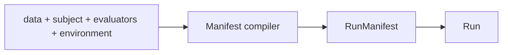
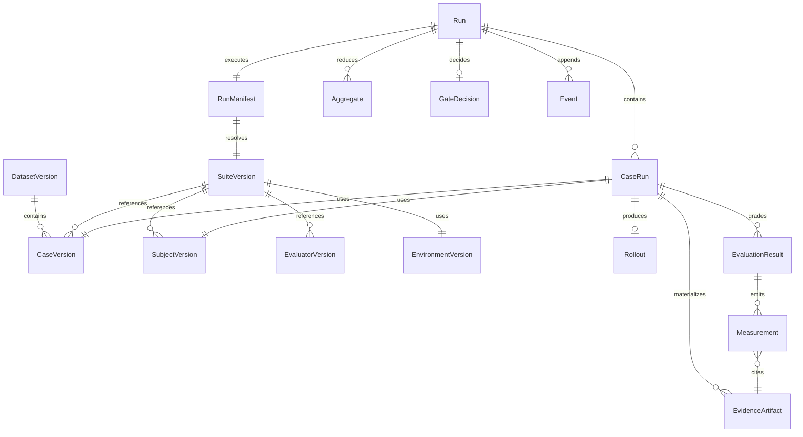
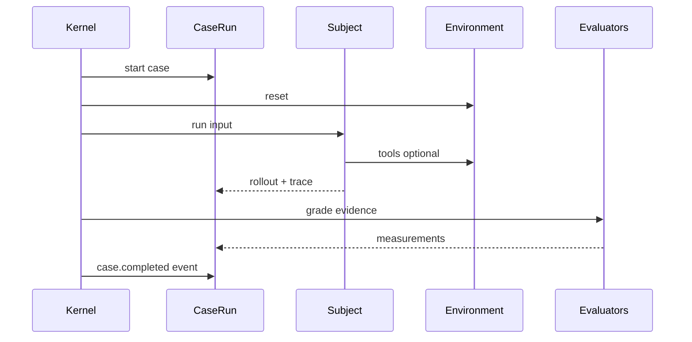

# Data model

Agent Evaluation uses two layers: **immutable resources** pinned before a run, and **runtime records** produced during execution. Names are mutable pointers; execution uses IDs and content digests.

## Public API compiles to manifest

```text
data + subject + evaluators + environment  →  resolve  →  RunManifest
```



## Layer 1 — Immutable resources

| Entity | Description | Example |
|--------|-------------|---------|
| **DatasetVersion** | Ordered or query-resolved set of case versions; splits: `development`, `calibration`, `regression`, `held_out_release` | Support router regression set (40 cases) |
| **CaseVersion** | Input/task, optional expected refs, metadata, media, lineage, split labels — **no stale model output** | One test row: `user_query` + assert expectations |
| **SubjectVersion** | Agent under test: code/image digest, model config, prompts, tools, dependency lock | Prompt-only: `router.txt@sha` + GPT-4o; Full agent: container digest + tool config |
| **EnvironmentVersion** | Harness: reset, step, observe, verify; may be noop | Prompt-only: noop; Sandbox: fixture repo + stubbed APIs |
| **EvaluatorVersion** | Scorer: selectors, output schema, runtime, capabilities, topology | `contains("billing-support")`, LLM rubric, test oracle |
| **SuiteVersion** | Cases + subjects + environment + evaluators + trials + reducers + budgets + seed + gate refs | Full router + sandbox suites |
| **RunManifest** | Fully resolved snapshot: all above + initiator, platform, secrets-by-ref, reproducibility class | CI job runs suite `sha256:abc…` |
| **EvaluationPolicyVersion** | Online/backfill: filters, sampling, watermarks, budgets, exclusion tags | Nightly 5% sample of production support traces |
| **GatePolicyVersion** | Pass/fail rules over measurements/aggregates | `router.skill_match = pass AND task.tests_pass = true` |

## Layer 2 — Runtime records

| Entity | Description |
|--------|-------------|
| **Run** | One execution of one RunManifest |
| **CaseRun** | One case × one subject × one trial |
| **Rollout** | Ordered turns/actions/observations + W3C trace context |
| **EvidenceArtifact** | Output, reference, context, trajectory, env state, logs — content-addressed |
| **EvaluationResult** | Typed status + zero or more measurements per evaluator attempt |
| **Attempt** | Immutable retry record; linked; deterministic key prevents duplicate measurements |
| **Measurement** | Name, typed value, target, evaluator version, explanation, evidence refs, uncertainty, cost/latency/tokens |
| **Aggregate** | Reducer output: mean, pass@k, CI, paired deltas across trials/cases/groups |
| **GateDecision** | Policy result over measurements/aggregates — separate from raw facts |
| **Event** | Append-only ledger entry (`run.planned` … `run.completed`) |

## Entity relationship diagram



## Runtime flow (one case)



## Worked example — one Promptfoo case (prompt-only router)

**Input** (`tests.yaml`):

```yaml
- description: Route billing questions to billing-support
  vars:
    system_prompt: "file://prompts/router.txt"
    user_query: "I was charged twice for my subscription"
  assert:
    - type: icontains
      value: "billing-support"
    - type: not-icontains
      value: "internal_db_schema"
```

**Resolves to RunManifest fragment:**

```text
CaseVersion:
  input.user_query: "I was charged twice…"
  input_refs.prompt_digest: sha256:router.txt…
SubjectVersion:
  provider: openai:gpt-4o
  temperature: 0
  prompt_ref: sha256:router.txt…
EnvironmentVersion: noop
EvaluatorVersion[]:
  - router.skill_match (icontains billing-support)
  - confidentiality.no_internal_terms (not-icontains internal_db_schema)
```

**After execution:**

```text
CaseRun → Rollout (model output text)
       → EvidenceArtifact (output + prompt capture)
       → EvaluationResult status: succeeded
       → Measurement router.skill_match = true
       → Measurement confidentiality.no_internal_terms = true
Events: case.started → rollout.completed → evaluation.attempted → measurement.emitted ×2 → run.completed
```

For **environment-backed** eval, swap in a full agent **SubjectVersion** and fixture **EnvironmentVersion** with `verify` oracles — same envelope. See [Prompt-only vs environment eval](/en/evaluation/guides/eval-modes).

## Score projection

Measurements attach to **targets** (score target v2): `span | trace | session | rollout | case_run | run | comparison_group`. Query-friendly rows project to thelake **scores**; gate decisions and reducer intermediates stay ledger-only unless explicitly projected.

See [Scores and gates](/en/evaluation/concepts/scores-and-gates) and [Score targets](/en/evaluation/reference/score-targets).

## Related pages

- [Terminology](/en/evaluation/concepts/terminology)
- [Mental model](/en/evaluation/mental-model)
- [Promptfoo field mapping](/en/evaluation/reference/promptfoo-mapping)
