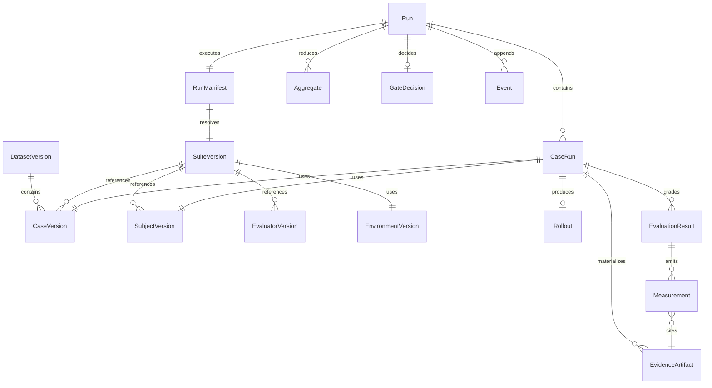

# Data model

Agent Evaluation uses two layers: **immutable resources** pinned before a run, and **runtime records** produced during execution. Names are mutable pointers; execution uses IDs and content digests.

## Public API compiles to manifest

```text
data + subject + evaluators + environment  →  resolve  →  RunManifest
```

## Layer 1 — Immutable resources

| Entity | Description | spcode / Promptfoo example |
|--------|-------------|----------------------------|
| **DatasetVersion** | Ordered or query-resolved set of case versions; splits: `development`, `calibration`, `regression`, `held_out_release` | All 8 routing cases in `tests.yaml` |
| **CaseVersion** | Input/task, optional expected refs, metadata, media, lineage, split labels — **no stale model output** | One test row: `user_query` + assert expectations |
| **SubjectVersion** | Agent under test: code/image digest, model config, prompts, tools, dependency lock | P1: `diagnose.txt@sha` + Gemini 2.5 Flash; P2: spcode binary + plugin digest |
| **EnvironmentVersion** | Harness: reset, step, observe, verify; may be noop | P1: noop; P2: fixture repo + stubbed `sp`/`sp_api` |
| **EvaluatorVersion** | Scorer: selectors, output schema, runtime, capabilities, topology | `icontains("sp-diagnosis")`, confidentiality scanner |
| **SuiteVersion** | Cases + subjects + environment + evaluators + trials + reducers + budgets + seed + gate refs | Full routing suite |
| **RunManifest** | Fully resolved snapshot: all above + initiator, platform, secrets-by-ref, reproducibility class | CI job runs suite `sha256:abc…` |
| **EvaluationPolicyVersion** | Online/backfill: filters, sampling, watermarks, budgets, exclusion tags | Nightly 5% sample of spcode diagnosis traces |
| **GatePolicyVersion** | Pass/fail rules over measurements/aggregates | `outcome_correct ≥ 0.9 AND confidentiality = pass` |

## Layer 2 — Runtime records

| Entity | Description |
|--------|-------------|
| **Run** | One execution of one RunManifest |
| **CaseRun** | One case × one subject × one trial |
| **Rollout** | Ordered turns/actions/observations + W3C trace context |
| **EvidenceArtifact** | Output, reference, context, trajectory, env state, logs — content-addressed |
| **EvaluationResult** | Typed status + zero or more measurements per evaluator attempt |
| **Attempt** | Immutable retry record; linked; deterministic key prevents duplicate measurements |
| **Measurement** | Name, typed value, target, evaluator version, explanation, evidence refs, uncertainty, cost/latency/tokens |
| **Aggregate** | Reducer output: mean, pass@k, CI, paired deltas across trials/cases/groups |
| **GateDecision** | Policy result over measurements/aggregates — separate from raw facts |
| **Event** | Append-only ledger entry (`run.planned` … `run.completed`) |

## Entity relationship diagram



## Worked example — one Promptfoo case (routing eval)

**Input** (`tests.yaml`):

```yaml
- description: Route replay failure diagnostics to sp-diagnosis
  vars:
    system_prompt: "file://../spcode-plugin/src/prompts/diagnose.txt"
    user_query: "Why did my replay of travel-ota fail with unexpected diffs?"
  assert:
    - type: icontains
      value: "sp-diagnosis"
    - type: not-icontains
      value: "sp_storage_db"
```

**Resolves to RunManifest fragment:**

```text
CaseVersion:
  input.user_query: "Why did my replay…"
  input_refs.prompt_digest: sha256:diagnose.txt…
SubjectVersion:
  provider: vertex:gemini-2.5-flash
  temperature: 0
  prompt_ref: sha256:diagnose.txt…
EnvironmentVersion: noop
EvaluatorVersion[]:
  - routing.skill_match (icontains sp-diagnosis)
  - confidentiality.no_internal_storage (not-icontains sp_storage_db)
```

**After execution:**

```text
CaseRun → Rollout (model output text)
       → EvidenceArtifact (output + prompt capture)
       → EvaluationResult status: succeeded
       → Measurement routing.skill_match = true
       → Measurement confidentiality.no_internal_storage = true
Events: case.started → rollout.completed → evaluation.attempted → measurement.emitted ×2 → run.completed
```

Phase 2 uses the same envelope with **SubjectVersion** = spcode process and **EnvironmentVersion** = troubleshooting fixture. See [Troubleshooting episodes](/en/evaluation/guides/spcode/troubleshooting-episodes).

## Score projection

Measurements attach to **targets** (score target v2): `span | trace | session | rollout | case_run | run | comparison_group`. Query-friendly rows project to thelake **scores**; gate decisions and reducer intermediates stay ledger-only unless explicitly projected.

See [Scores and gates](/en/evaluation/concepts/scores-and-gates) and [Score targets](/en/evaluation/reference/score-targets).

## Related pages

- [Terminology](/en/evaluation/concepts/terminology) — alphabetical glossary
- [Promptfoo field mapping](/en/evaluation/reference/promptfoo-mapping)
- [Result status](/en/evaluation/reference/result-status) — not the same as measurements
