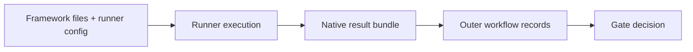
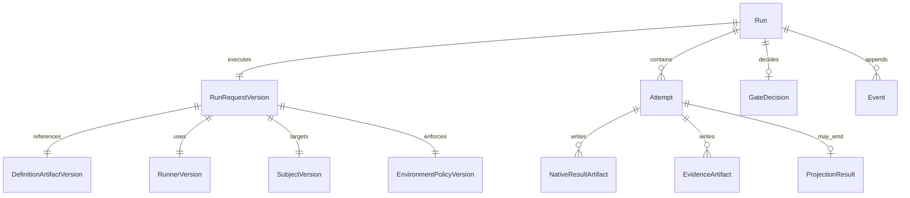

# Data model

Agent Evaluation separates **framework-native artifacts** from **workflow records**.

## Core flow

```text
framework-native suite + subject + environment policy
→ framework runner
→ native result bundle + evidence
→ Softprobe lifecycle + compare + gate
```



## Layer A — Pinned inputs (before execution)

| Entity | Description | Example |
|--------|-------------|---------|
| **DefinitionArtifactVersion** | Content-addressed framework definition bundle | Promptfoo config/tests/prompts bundle digest |
| **RunnerVersion** | Runner id, runtime image digest, framework version | `promptfoo-runner@2.1.0` + image sha |
| **SubjectVersion** | The target system under test identity | `support-agent@sha256:...` or hosted model route |
| **EnvironmentPolicyVersion** | Capability and isolation policy | network off, mounts, secret refs, limits |
| **RunRequestVersion** | The pinned request object referencing all above | request digest used in CI |
| **GatePolicyVersion** | Release policy over outer status and projected measurements | `status=succeeded` and selected checks |

## Layer B — Runtime records (during/after execution)

| Entity | Description |
|--------|-------------|
| **Run** | One execution of one RunRequestVersion |
| **Attempt** | One runner attempt with retry linkage |
| **NativeResultArtifact** | Full framework-native result files |
| **EvidenceArtifact** | Logs, traces, usage/cost, stdout/stderr, attachments |
| **ProjectionResult** | Optional projected measurements and loss diagnostics |
| **GateDecision** | Policy outcome for release/governance |
| **Event** | Outer lifecycle events (`requested`, `validated`, `running`, `terminal`) |

## ER diagram



## Worked example (Promptfoo runner)

**Input**

```yaml
runner: promptfoo-runner@2.1.0
definition_artifact: cas://sha256:promptfoo-def-bundle
subject: support-router-prod
environment_policy:
  network: off
  secrets: [OPENAI_API_KEY_REF]
  limits: { timeout_s: 300, max_result_mb: 50 }
gate_policy: support-router-v1
```

**After execution**

```text
Run.status = succeeded
NativeResultArtifact = cas://sha256:promptfoo-results
ProjectionResult.status = lossy
GateDecision = pass
```

**Lifecycle events**

```text
run.requested → run.validated → run.running → run.terminal
```

## Projection note

Projection is optional. Unsupported framework fields remain in native artifacts and are represented as diagnostics. Softprobe does not require full DSL parity mapping.

## Related

- [Framework adapters](/en/evaluation/reference/framework-adapters)
- [Promptfoo integration](/en/evaluation/guides/promptfoo-integration)
- [Scores and gates](/en/evaluation/concepts/scores-and-gates)
