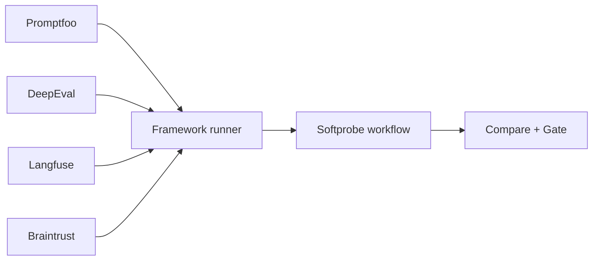

# Ecosystem mapping

Softprobe integrates frameworks as runners, not as schema replacements.

## Mapping in one view

## Promptfoo

| Promptfoo concept | Softprobe concept |
|-------------------|-------------------|
| `promptfooconfig.yaml` + `tests.yaml` | Definition artifact bundle |
| `promptfoo eval` | Framework runner execution inside workflow |
| `.promptfoo` results | Native result artifact + diagnostics |
| cell pass/fail | Optional projected measurement (non-authoritative) |

## DeepEval

| DeepEval concept | Softprobe concept |
|------------------|-------------------|
| test case definitions | Definition artifact bundle |
| metric execution | Runner-owned semantics |
| metric outputs | Native result artifact + optional projection |

## Braintrust / Langfuse

Softprobe can ingest/export datasets and traces, but release gates and lifecycle remain in Softprobe workflow.

## Deliberate difference

Softprobe does **not** attempt complete parity translation of each framework DSL into a new universal schema.
