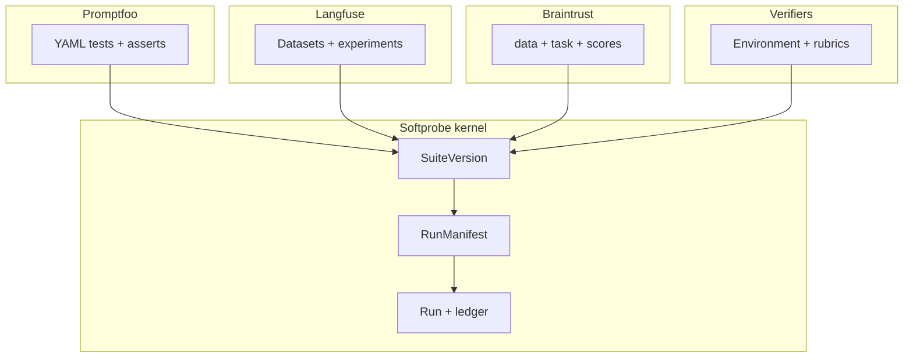

# Ecosystem mapping

If you know Promptfoo, Langfuse, Braintrust, or Prime Intellect Verifiers, this page maps their concepts to Softprobe Agent Evaluation — and where we deliberately differ.

## Promptfoo → Softprobe

| Promptfoo | Softprobe | Notes |
|-----------|-----------|-------|
| `promptfooconfig.yaml` | **SuiteVersion** (via importer) | Kernel compiles to manifest; Promptfoo does not orchestrate inside a run |
| `tests` / `vars` | **CaseVersion** inputs | `system_prompt`, `user_query` → case fields + prompt digest |
| `assert` / `defaultTest.assert` | **EvaluatorVersion[]** | `icontains` → builtin evaluator; unsupported → typed diagnostic at `sp eval validate` |
| `providers` | **SubjectVersion** provider descriptor | Matrix expands at plan time in kernel |
| `prompts` | Subject prompt refs or case vars | Pinned by digest in manifest |
| Matrix (prompt × provider × test) | **CaseRun** grid | Kernel-owned scheduling |
| `promptfoo eval` | **`sp eval run`** | Same semantics local and managed |
| `.promptfoo` / `promptfoo view` | Native diagnostics as **artifacts** | Query via API/projections; UI not authoritative SoR |
| Provider cache | Kernel cache on pure/hermetic nodes | External cache is not source of truth |

Integration modes: [Promptfoo integration](/en/evaluation/guides/promptfoo-integration).

## Langfuse → Softprobe

| Langfuse | Softprobe | Notes |
|----------|-----------|-------|
| Dataset + items | **DatasetVersion** + **CaseVersion** | Immutable versions; prod → case with governance |
| Experiment / dataset run | **Run** on dataset snapshot | One kernel semantics local + managed |
| Evaluator template | **EvaluatorVersion** capability descriptor | Open topology, not `LLM_AS_JUDGE \| CODE` enum |
| Job configuration | Compiled **RunManifest** | No mutable DB rows as source of truth |
| Score on trace/observation | **Measurement** → score projection | Score target v2 adds rollout/case_run/run |
| LLM-as-a-judge on live traces | **EvaluationPolicyVersion** | Sampling, watermarks, loop guard |
| Annotation queue | **Human evaluator** runtime | Async evaluator, not separate score subsystem |
| Variable mapping | **Evidence selectors** + `missing_evidence` | Explicit, not silent template gaps |

See [Langfuse and Braintrust adoption](/en/evaluation/guides/langfuse-and-braintrust-adoption).

## Braintrust → Softprobe

| Braintrust | Softprobe | Notes |
|------------|-----------|-------|
| `data` | **DatasetVersion** / `data` in public API | |
| `task` | **SubjectVersion** + **EnvironmentVersion** | Environment outcomes first-class |
| `scores` / scorers | **EvaluatorVersion[]** | |
| Experiment | **Run** + **RunManifest** | Portable export |
| Online scoring rule | **EvaluationPolicyVersion** | Filters, sampling, span vs trace scope |
| Playground → CI → production loop | [Evaluation loop](/en/evaluation/concepts/evaluation-loop) | Documented flywheel |
| Production log → dataset | [Production-to-eval loop](/en/evaluation/guides/production-to-eval-loop) | Governed proposal/approval |

Braintrust mental model `data + task + scores` maps directly to our public API:

```text
data + subject + evaluators + environment
```

## Concept map (all ecosystems)



## Prime Intellect Verifiers → Softprobe

| Verifiers | Softprobe | Notes |
|-----------|-----------|-------|
| Environment (SingleTurn, Tool, Stateful) | **EnvironmentVersion** + **SubjectVersion** | Rollout export interoperable; training orchestration out of scope |
| Dataset / taskset | **DatasetVersion** | |
| Rubric / reward functions | **EvaluatorVersion** + **Reducer** | Named measurements; no single opaque scalar replaces evidence |
| Weighted rewards | **Reducer** over measurements | Gates consume aggregates |
| `JudgeRubric` | Model-backed **EvaluatorVersion** | Pinned prompt/model in descriptor |
| Group scoring / pass@k | **Aggregate** + trial groups | |
| Sandbox harness | **EnvironmentVersion** verify contract | Outcomes beat transcript-only grading |

## Deliberate differences

Softprobe **does not** copy these patterns:

| Anti-pattern | Softprobe approach |
|--------------|-------------------|
| Promptfoo local SQLite as product SoR | thelake append-only ledger + CAS artifacts |
| Langfuse closed evaluator kind union | Capability-described evaluators + group/stream/aggregate topologies |
| Separate local vs managed experiment semantics | One `sp-eval-kernel` contract everywhere |
| DeepEval proprietary trace graph | OTLP + canonical trajectory library |
| Framework pass/fail as release gate | Kernel recomputes **GatePolicyVersion**; framework flags are measurements/provenance |
| Prime Intellect training loop in eval core | Export rollouts + score vectors; training out of scope |
| Nested framework orchestrator under kernel | Importer or single sandboxed evaluator node only |

## Next steps

- [Data model](/en/evaluation/concepts/data-model)
- [Promptfoo integration](/en/evaluation/guides/promptfoo-integration)
- [Evaluation loop](/en/evaluation/concepts/evaluation-loop)
