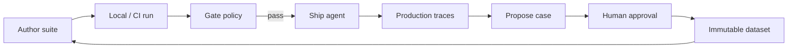

# Evaluation loop

Agent Evaluation supports a continuous quality flywheel — similar to Braintrust's playground → experiment → CI → production pattern, with Softprobe-specific governance and portable manifests.



## 1. Iterate locally

Authors prototype suites in Promptfoo YAML, SDK, or UI. `sp eval validate` catches schema and capability errors before model cost.

## 2. Gate in CI

Pin suite digest in GitHub Actions (or equivalent). `sp eval run --gate <policy>` blocks merges on output-policy, confidentiality, or outcome regressions.

## 3. Compare versions

`sp eval compare` diffs candidate vs baseline manifests with uncertainty where trials are stochastic.

## 4. Score in production (online)

**EvaluationPolicyVersion** samples production traces, snapshots evidence, and runs evaluators asynchronously — no added request latency.

## 5. Feed back to datasets

Interesting failures become **candidate cases** through a governed workflow:

```text
production evidence → propose → review → approve → publish CaseVersion → join regression split
```

AI agents may **propose** cases; they cannot **approve** or activate gates on their own proposals.

See [Production-to-eval loop](/en/evaluation/guides/production-to-eval-loop).

## Softprobe vs Braintrust loop

| Stage | Braintrust | Softprobe |
|-------|------------|-----------|
| Author | Playground / SDK | Promptfoo, SDK, API → manifest |
| Offline eval | Experiment | **Run** (same kernel local/managed) |
| CI | `eval` in pipeline | `sp eval run` + JUnit |
| Online | Online scoring rules | **EvaluationPolicyVersion** |
| Prod → dataset | Add to dataset from logs | Governed proposal + digest-bound approval |

Portable **RunManifest** and **thelake** ledger make the loop auditable across environments.
