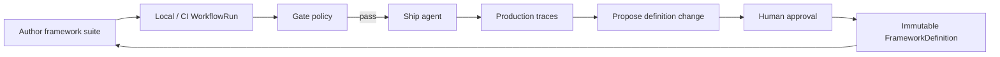

# Evaluation loop

Agent Evaluation supports a continuous quality flywheel — similar to Braintrust's playground → experiment → CI → production pattern — with Softprobe governance and portable **WorkflowVersion** digests. Softprobe does not replace Promptfoo/DeepEval authoring.



## 1. Iterate locally

Authors prototype in Promptfoo YAML, DeepEval, SDK, or UI. `sp eval validate` checks closed FrameworkDefinition pins and runner capabilities before model cost — without translating assertions.

## 2. Gate in CI

Pin WorkflowVersion digest in GitHub Actions (or equivalent). `sp eval run` + gate policy blocks merges on framework-reported regressions Softprobe is configured to enforce.

## 3. Compare versions

`sp eval compare` diffs candidate vs baseline WorkflowRuns on selected projected fields and/or runner-reported summaries.

## 4. Score in production (online)

An **online policy** samples production traces, snapshots evidence, and launches the **same framework runner** asynchronously — no added request latency.

## 5. Feed back to framework packs

Interesting failures become **candidate FrameworkDefinition** changes through a governed workflow:

```text
production evidence → propose → review → approve → publish FrameworkDefinition → pin in WorkflowVersion
```

AI agents may **propose**; they cannot **approve** or activate gates on their own proposals.

See [Production-to-eval loop](/en/evaluation/guides/production-to-eval-loop).

## Softprobe vs Braintrust loop

| Stage | Braintrust | Softprobe |
|-------|------------|-----------|
| Author | Playground / SDK | Promptfoo / DeepEval / … (framework-native) |
| Offline eval | Experiment | **WorkflowRun** (same kernel local/managed) |
| CI | `eval` in pipeline | `sp eval run` + native reports |
| Online | Online scoring rules | Online policy + framework runner |
| Prod → dataset | Add to dataset from logs | Governed proposal + digest-bound FrameworkDefinition |

Portable **WorkflowVersion** digests and the **thelake** ledger make the loop auditable across environments.
