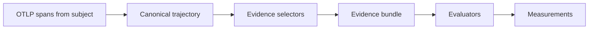
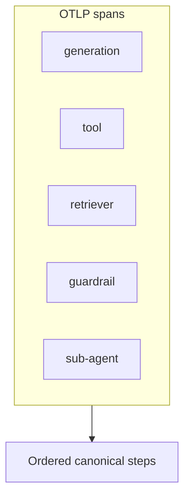
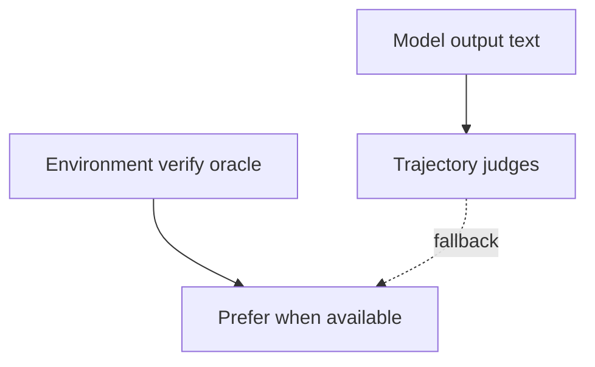
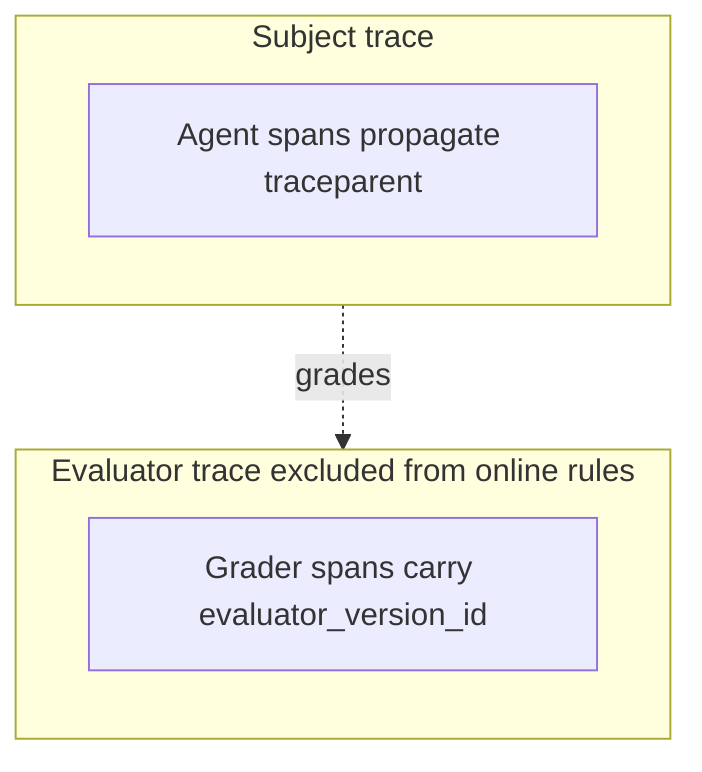

# Evidence and trajectories

Evaluators grade **evidence** — not raw intuition. **OTLP is the observation boundary**: Softprobe normalizes OpenTelemetry (and known framework attributes) into a canonical trajectory view.

## Evidence pipeline

## Evidence types

| Type | Examples |
|------|----------|
| Model output | Assistant text, structured JSON |
| Trajectory | Tool calls, ordering, span attributes |
| Reference | Expected answer, rubric, gold labels |
| Context | Retrieved documents, fixture API responses |
| Environment state | DB snapshot, file tree, sandbox verifier result |
| Media | Screenshots, audio (multimodal judges) |

All stored as **EvidenceArtifact** records with content digests and provenance.

## Evidence before score

Every measurement should cite evidence references so reviewers can answer: *what did the grader see?*

If required evidence is absent, status is **`missing_evidence`** — never an implicit zero score.

## Canonical trajectory

One shared **trajectory** library converts OTLP spans into ordered steps:

- generation, tool, retriever, guardrail, sub-agent spans
- normalized tool names and arguments (per supported semconv profile)
- diagnostics when conventions are partial or unknown

Evaluators declare **evidence selectors** (e.g. `trajectory.tools[*].name`, `rollout.final_output`) instead of re-parsing raw OTLP per scorer.

## Outcomes beat transcripts

When an **environment verifier** can check final state (tests pass, oracle DB row, task completion), prefer that over trajectory-only or output-only judges.

Trajectory judges remain valuable when no reliable oracle exists (routing text, dialogue quality).

## Eval vs subject spans

- **Subject spans** — agent under test (propagate `traceparent` from case run)
- **Evaluator spans** — grader execution (separate; carry `evaluator_version_id`)

Online policies exclude eval-execution traces by default to prevent recursive evaluation loops.

See [Correlation and traces](/en/evaluation/concepts/correlation-and-traces).

## Related

- [Trajectory and tools evaluators](/en/evaluation/evaluators/trajectory-and-tools)
- [Environment outcome](/en/evaluation/evaluators/environment-outcome)
