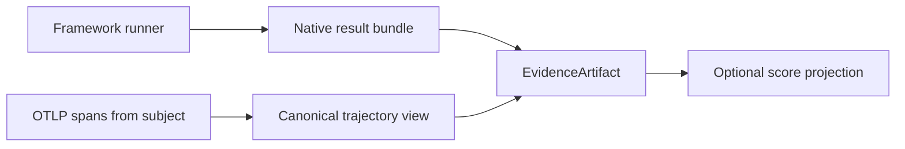
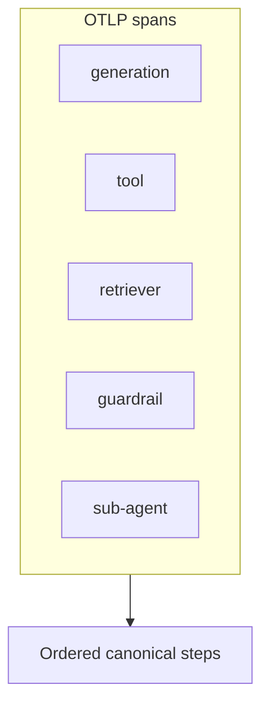
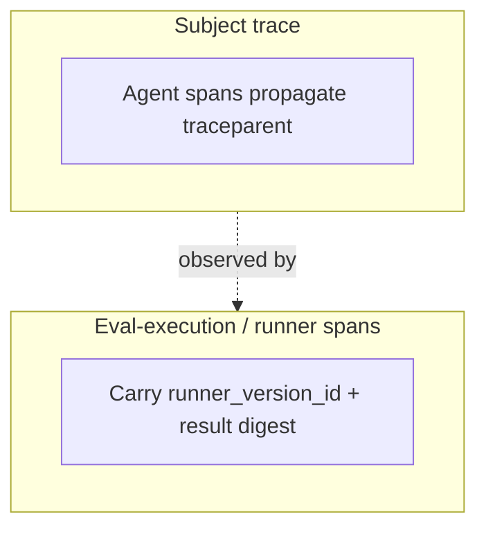

# Evidence and trajectories

Frameworks grade **evidence**. Softprobe’s job is to **capture and correlate** that evidence (native result bundles, logs, OTLP) — not to re-implement Softprobe scorers over trajectories.

**OTLP is the observation boundary**: Softprobe normalizes OpenTelemetry (and known framework attributes) into a canonical trajectory view for drill-down and optional projection.

## Evidence pipeline

## Evidence types

| Type | Examples |
|------|----------|
| Native framework results | Promptfoo/DeepEval reports, assertion detail |
| Model output | Assistant text, structured JSON |
| Trajectory | Tool calls, ordering, span attributes |
| Reference | Expected answer, rubric, gold labels (framework-owned) |
| Context | Retrieved documents, fixture API responses |
| Environment state | DB snapshot, file tree, harness verify output |
| Media | Screenshots, audio |

All Softprobe-stored material is an **EvidenceArtifact** with content digests and provenance. Softprobe does not require Softprobe “evidence selectors” as a Softprobe evaluator ABI.

## Evidence before score

Projected measurements should cite evidence references so reviewers can answer: *what did the grader see?*

If required evidence is absent, FrameworkAttempt status is **`missing_evidence`** — never an implicit zero score.

## Canonical trajectory

One shared **trajectory** library converts OTLP spans into ordered steps for correlation and UI:

- generation, tool, retriever, guardrail, sub-agent spans
- normalized tool names and arguments (per supported semconv profile)
- diagnostics when conventions are partial or unknown

Frameworks may consume OTEL independently (e.g. Promptfoo tracing). Softprobe does not force Softprobe scorers to re-parse OTLP.

## Outcomes beat transcripts

When an **environment verifier** (harness / framework oracle) can check final state, prefer that over trajectory-only or output-only judges — still **inside the framework suite**. Softprobe EnvironmentVersion provides isolation and mounts; Softprobe does not own Softprobe outcome-oracle scorers.

## Runner vs subject spans

- **Subject spans** — agent under test (`traceparent` from FrameworkAttempt)
- **Runner / eval-execution spans** — Softprobe + framework runner (`runner_version_id`, native result digest)

Online policies exclude eval-execution traces by default to prevent recursive evaluation loops.

See [Correlation and traces](/en/evaluation/concepts/correlation-and-traces).

## Related

- [Trajectory and tools](/en/evaluation/evaluators/trajectory-and-tools)
- [Environment outcome](/en/evaluation/evaluators/environment-outcome)
- [Framework runners](/en/evaluation/reference/framework-adapters)
