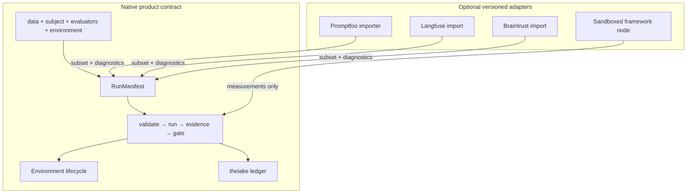

# Native model and framework adapters

Softprobe Agent Evaluation is **framework-agnostic**. The product contract is the **RunManifest** and kernel workflow — not a JSON clone of Promptfoo, Langfuse, or Braintrust.

## What we own vs what we bridge



| Layer | You standardize on |
|-------|-------------------|
| **Authoring (recommended)** | Native suite / manifest, SDK, or REST compile API |
| **Execution** | `sp-eval-kernel` DAG + environment + evaluators |
| **Storage & gates** | Events, artifacts, measurements, GatePolicyVersion |
| **Framework files** | Optional input; provenance preserved, not the SoR |

Promptfoo has dozens of assertion types and adds more over time. **We do not maintain a perfect field-by-field mapping.** Adapters translate a **supported subset**, emit **typed diagnostics** for the rest, and preserve framework digests for audit.

## The four ingredients (always)

Every eval run — regardless of how you authored it — resolves to:

```text
data + subject + evaluators + environment  →  RunManifest
```

**Example — support router (prompt-only):**

```yaml
# suites/support-router-v1.yaml (native authoring)
cases:
  - id: billing_double_charge
    title: Route billing questions to billing-support
    input:
      user_query: "I was charged twice for my subscription"
    input_refs:
      prompt: file://prompts/router.txt

subject:
  provider: openai:gpt-4o
  temperature: 0
  prompt_ref: file://prompts/router.txt

environment:
  type: noop

evaluators:
  - id: router.skill_match
    capability: builtin/deterministic/contains@1
    params: { pattern: billing-support, selector: rollout.output }
  - id: confidentiality.no_internal_terms
    capability: builtin/deterministic/not-contains@1
    params: { pattern: internal_db_schema, selector: rollout.output }

gate: support-router-v1
```

Compile and run:

```bash
sp eval validate --suite suites/support-router-v1.yaml --out .softprobe/manifest.json
sp eval run --manifest .softprobe/manifest.json --gate support-router-v1 --out-dir .softprobe/runs/latest
```

The resolved **RunManifest** pins digests (`sha256:router.txt…`, evaluator versions). That JSON is the portable contract — not “Promptfoo YAML expressed as JSON.”

## Workflow (what customers adopt)


1. **Author** cases + subject + evaluators + **environment** (noop, fixture, or sandbox)
2. **Validate** — compile manifest, zero model cost, catch capability errors
3. **Run** — kernel executes DAG; subject runs *inside* environment
4. **Grade** — evaluators consume evidence bundles (output, trajectory, oracle state)
5. **Gate** — versioned policy over measurements; compare runs for release

Environment is first-class: prompt-only eval uses `noop`; agent eval uses fixtures with `verify` oracles. See [Eval modes](/en/evaluation/guides/eval-modes).

## Three framework integration modes

When you already use Promptfoo or similar:

| Mode | Use when | Kernel owns |
|------|----------|-------------|
| **1. Importer** | Migrating YAML cases | Manifest, run, gates, ledger |
| **2. Sandboxed node** | One exotic assertion library | Everything except that node's method |
| **3. Opaque legacy import** | Archiving a whole old run | Provenance only; limited portability claims |

Details: [Framework adapters](/en/evaluation/reference/framework-adapters) · [Promptfoo integration](/en/evaluation/guides/promptfoo-integration).

### What importers promise

- Map **supported** constructs to CaseVersion / EvaluatorVersion / SubjectVersion
- **`unsupported`** / **`lossy_mapping`** diagnostics — never silent pass
- Preserve adapter version + source config digest in manifest provenance
- Do **not** promise every future Promptfoo assert type

### What importers do not do

- Replace native environment/outcome evaluators with assert hacks
- Use framework SQLite or result files as system of record
- Let framework code schedule trials, retries, or authoritative gates inside a kernel run

## Evaluators are capabilities, not assert enums

Instead of mirroring `assert[].type`, you reference **EvaluatorVersion** by capability descriptor:

```yaml
evaluators:
  - id: task.tests_pass
    capability: builtin/environment/outcome@1
    params: { oracle: integration_tests }
  - id: support.grounded
    capability: plugin/llm-judge@3
    params: { rubric_ref: file://rubrics/groundedness.txt, model: openai:gpt-4o }
```

New grading methods ship as **plugins** with descriptors — not new assert types in a central enum.

## Example — same scenario, two environments

**Prompt-only** (fast CI):

```yaml
environment: { type: noop }
evaluators:
  - id: router.skill_match
    capability: builtin/deterministic/contains@1
    params: { pattern: billing-support }
```

**Sandbox agent** (nightly):

```yaml
environment:
  type: fixture
  ref: oci://billing-sandbox@sha256:…
  verify: integration_tests

subject:
  ref: oci://support-agent@sha256:…

evaluators:
  - id: task.tests_pass
    capability: builtin/environment/outcome@1
  - id: agent.tool_policy
    capability: builtin/trajectory/tools@1
```

Same workflow; different **SubjectVersion** and **EnvironmentVersion**.

## Related

- [Quick start](/en/evaluation/getting-started) — full walkthrough with examples
- [Author a suite](/en/evaluation/guides/author-a-suite)
- [Data model](/en/evaluation/concepts/data-model)
- [Ecosystem mapping](/en/evaluation/concepts/ecosystem-mapping)
