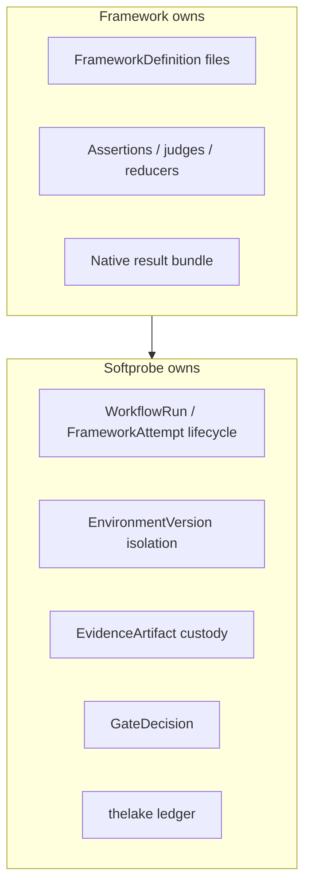
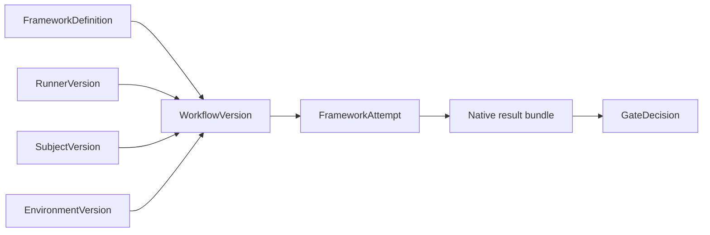
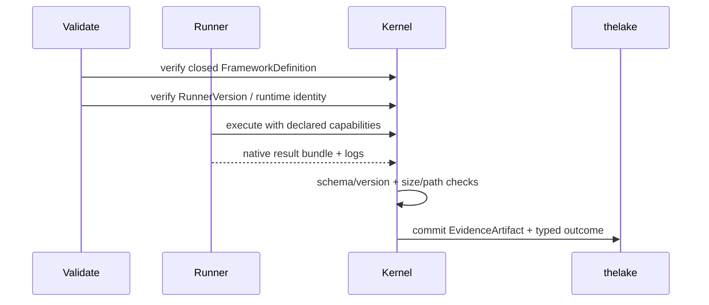

# Native model and framework runners

Softprobe Agent Evaluation is **framework-agnostic** and **runner-first**: frameworks keep their own DSL and semantics; Softprobe owns workflow, environment, evidence custody, comparison, and release gates.

Softprobe does **not** ship a native eval authoring language, Softprobe-owned scorers, or a 1:1 importer that rewrites every Promptfoo/DeepEval feature into Softprobe JSON.

## Ownership boundary



## Default integration: opaque framework runner

Run Promptfoo/DeepEval (or another tool) as a pinned execution node — no assertion translation.



**Concrete example**

```yaml
framework_definition: cas://sha256:promptfoo-config-bundle
runner:
  id: promptfoo-runner@2.1.0
  runtime_image: ghcr.io/softprobe/promptfoo-runner@sha256:abc...
subject: support-router@sha256:...
environment:
  network: off
  filesystem: [workspace:ro, artifacts:rw]
  secrets: [OPENAI_API_KEY_REF]
gate_policy: support-router-v1
```

Softprobe records definition digest, runner/runtime digest, native result bundle, outer typed terminal status, and optional projected measurements.

## Optional loss-aware projection

Map a **supported subset** of native results into first-class score rows. Unsupported fields remain in native artifacts and never block execution.

There is **no** separate Softprobe “kernel evaluator mode” for product grading. Control-plane checks (artifact integrity, redaction, capability admission, release gates) are workflow policies — not an eval DSL.

## Why runner-first beats full translation

| Approach | Problem |
|----------|---------|
| Full DSL translation | Constant catch-up with framework features |
| Softprobe-native suite authoring | Reinvents mature ecosystems |
| Runner-first | Stable workflow/environment contract + preserved native semantics |

## Public product API

```text
framework suite + subject + environment + runner
        → WorkflowVersion
        → WorkflowRun / FrameworkAttempt
        → evidence + GateDecision
```

## Pre/post acceptance rules



- Pre-run: all file refs resolved and hashed; runner/runtime pinned.
- Post-run: malformed/oversized bundles rejected; no path traversal.
- No ambient network/secrets; only declared capabilities.

## Related

- [Framework runners](/en/evaluation/reference/framework-adapters)
- [Promptfoo integration](/en/evaluation/guides/promptfoo-integration)
- [Mental model](/en/evaluation/mental-model)
- [Quick start](/en/evaluation/getting-started)
