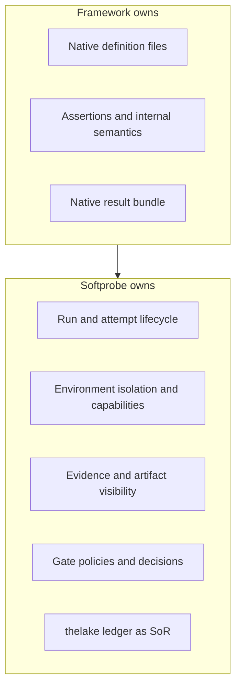
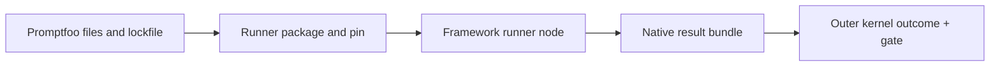
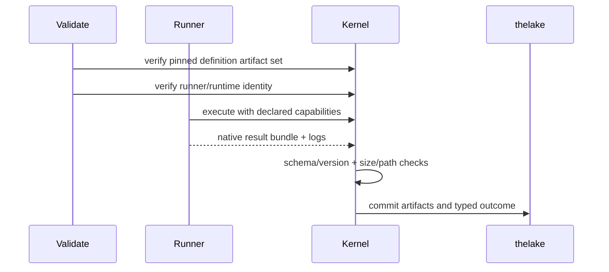

# Native model and framework runners

Softprobe Agent Evaluation is **framework-agnostic**, but interoperability is **runner-first** (per design): frameworks keep their own DSL and semantics; Softprobe owns workflow, environment, evidence custody, and release gates.

## Ownership boundary



Framework-native IDs and pass/fail values are preserved as provenance. They do not become kernel identities unless a later explicit projection contract supports it.

## Three integration modes

### 1) Opaque framework runner (default interop)

Run Promptfoo/DeepEval as a pinned framework execution node, without translating every framework feature into Softprobe schema.



**Concrete example**

```yaml
# suite excerpt
subject:
  type: framework_runner
  runner:
    id: promptfoo-runner@2.1.0
    runtime_image: ghcr.io/softprobe/promptfoo-runner@sha256:abc...
  definition_artifact:
    ref: cas://sha256:promptfoo-config-bundle
  capabilities:
    network: off
    filesystem: [workspace:ro, artifacts:rw]
    secrets: [OPENAI_API_KEY_REF]
```

Softprobe records:
- definition digest bundle,
- runner/runtime digest,
- native result bundle (`results.json`, logs),
- outer typed terminal status,
- optional projected measurements.

### 2) Sandboxed kernel component

Use a deliberately small kernel-owned evaluator for primitives Softprobe intentionally owns (confidentiality scans, tool-policy checks, end-state verification).

### 3) Optional loss-aware projection

Map a supported subset of native framework results into first-class measurements. Unsupported fields remain in native artifacts and never block execution.

## Why runner-first beats full translation

| Approach | Problem |
|----------|---------|
| Full DSL translation | Constant catch-up with framework features |
| Runner-first | Stable workflow/environment contract + preserved native semantics |

This avoids a brittle “Promptfoo-as-JSON” model while still enabling migration and cross-framework gates.

## Pre/post acceptance rules (important)



- Pre-run: all file refs resolved and hashed; runner/runtime pinned.
- Post-run: malformed/oversized bundles rejected; no path traversal.
- No ambient network/secrets; only declared capabilities.

## What stays universal

Even with runners, the product API remains:

```text
data + subject + evaluators + environment  →  RunManifest
```

And the workflow remains:

```text
validate → run → evidence → measurements/aggregates → gate
```

## Related

- [Framework adapters](/en/evaluation/reference/framework-adapters)
- [Promptfoo integration](/en/evaluation/guides/promptfoo-integration)
- [Quick start](/en/evaluation/getting-started)
