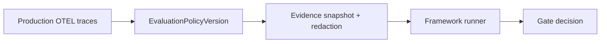

# Online evaluation

**Online evaluation** applies the same evaluator semantics as offline runs to production traces — asynchronously, with sampling and watermarks.

## Offline vs online

| Mode | Evidence source | Typical trigger | Primary objective |
|------|------------------|-----------------|-------------------|
| Offline | Curated suites / fixtures | CI and PR checks | Prevent release regressions |
| Online | Production traces selected by policy | Scheduled/continuous | Detect live drift and incident patterns |

See [Online vs offline evaluation](/en/evaluation/concepts/online-vs-offline).

## EvaluationPolicyVersion

An online policy selects:

- Immutable evaluator/suite versions
- Trace/span filters (environment, tags, metadata)
- **Stable sampling** — hash(target_id + policy_version) for reproducible inclusion
- **Completion/watermark** policy for late spans
- Max rate, cost, concurrency, priority
- Exclusion tags for internal evaluator traces
- Evidence snapshot and re-scoring rules

The scheduler emits ordinary run/case events — online, batch, and backfill share kernel planning and retry semantics.

## Comparison to Braintrust online scoring

| Braintrust | Softprobe |
|------------|-----------|
| Automation rule per project | **EvaluationPolicyVersion** |
| Span vs trace scope | Configurable evidence selectors |
| Sampling rate | Stable deterministic sampling + budgets |
| Async scoring | Managed worker queue; no request latency impact |

## Backfill

Historical trace snapshots re-run under a pinned policy version for before/after comparisons when model or prompt changes.

## Governance

Production content reaches evaluators only when sensitivity/residency **capabilities** match. Snapshot + redaction occur before case materialization.

See [Promptfoo on production OTEL traces](/en/evaluation/guides/promptfoo-online-otel) and [Production-to-eval loop](/en/evaluation/guides/production-to-eval-loop).
