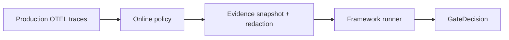

# Online evaluation

**Online evaluation** applies the same **framework runner** workflow as offline runs to production traces — asynchronously, with sampling and watermarks. Softprobe does not switch to a parallel Softprobe-owned grader.

## Offline vs online

| Mode | Evidence source | Typical trigger | Primary objective |
|------|------------------|-----------------|-------------------|
| Offline | Curated FrameworkDefinition / fixtures | CI and PR checks | Prevent release regressions |
| Online | Production traces selected by policy | Scheduled/continuous | Detect live drift and incident patterns |

See [Online vs offline evaluation](/en/evaluation/concepts/online-vs-offline).

## Online policy

An online policy selects:

- Pinned FrameworkDefinition / RunnerVersion / WorkflowVersion
- Trace/span filters (environment, tags, metadata)
- **Stable sampling** — hash(target_id + policy_version) for reproducible inclusion
- **Completion/watermark** policy for late spans
- Max rate, cost, concurrency, priority
- Exclusion tags for internal eval-execution traces
- Evidence snapshot rules before the runner starts

The scheduler emits ordinary WorkflowRun events — online, batch, and backfill share kernel planning and retry semantics.

## Comparison to Braintrust online scoring

| Braintrust | Softprobe |
|------------|-----------|
| Automation rule per project | Online policy + framework runner |
| Span vs trace scope | Evidence snapshot selectors |
| Sampling rate | Stable deterministic sampling + budgets |
| Async scoring | Managed worker queue; no request latency impact |

## Backfill

Historical trace snapshots re-run under a pinned policy / WorkflowVersion for before/after comparisons when model or prompt changes.

## Governance

Production content reaches runners only when sensitivity/residency **capabilities** match. Snapshot + redaction occur before FrameworkAttempt.

See [Promptfoo on production OTEL traces](/en/evaluation/guides/promptfoo-online-otel) and [Production-to-eval loop](/en/evaluation/guides/production-to-eval-loop).
