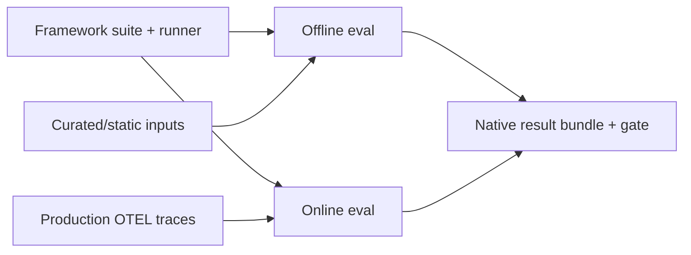
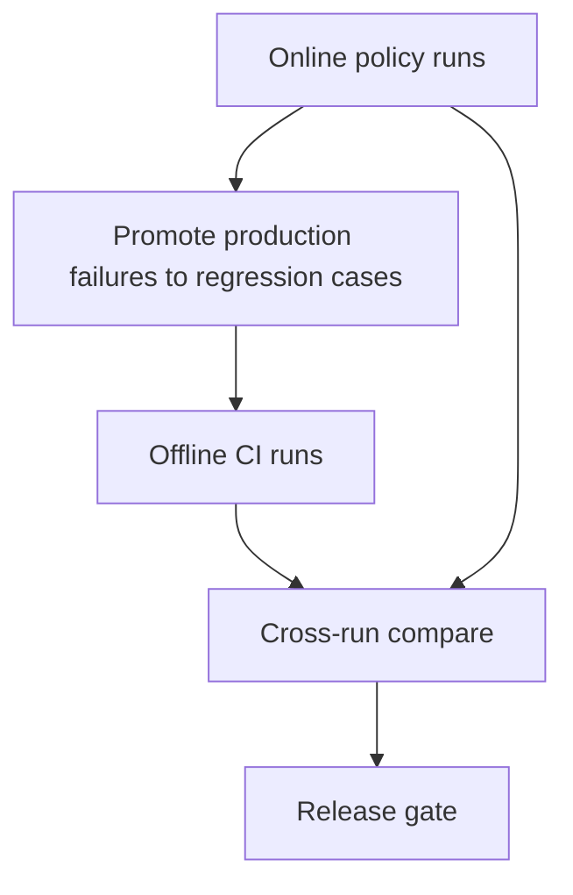

# Online vs offline evaluation

Both modes use the same workflow engine and gating model. The difference is **where the evidence comes from**.

## At a glance



| Dimension | Offline evaluation | Online evaluation |
|-----------|--------------------|-------------------|
| Evidence source | Curated cases / replay fixtures / static inputs | Production traces selected by policy |
| Runtime timing | Dev, CI, pre-release | Continuous or scheduled after deployment |
| Goal | Catch regressions before release | Detect drift/failures in real traffic |
| Cost control | Fixed by suite size | Policy-driven sampling and budgets |
| Governance | Standard CI permissions | Stronger data handling (redaction, residency, approval) |

## Offline example (CI)

```bash
sp eval run \
  --runner promptfoo-runner@2.1.0 \
  --definition .softprobe/promptfoo-definition.cas.json \
  --gate support-router-v1 \
  --out-dir .softprobe/runs/ci
```

## Online example (production traces)

```bash
sp eval policy apply --file policies/support-router-online-v1.yaml
sp eval policy run --policy support-router-online-v1 --window "last_1h"
```

Policy chooses traces, snapshots evidence, then executes the same runner.

## Policy example

```yaml
policy_id: support-router-online-v1
trace_filter:
  service.name: support-router
  environment: production
sampling:
  strategy: stable_hash
  rate: 0.05
watermark:
  wait_for_late_spans_s: 120
budgets:
  max_runs_per_hour: 500
  max_eval_cost_usd_per_day: 100
exclusions:
  - eval.execution=true
```

## Why online is not just "run promptfoo on prod"

Promptfoo traces help offline evaluation and local introspection. Online evaluation adds platform guarantees:

- controlled snapshotting and redaction before runner execution,
- stable sampling for reproducibility,
- exclusion of eval-generated traces (loop guard),
- tenancy and residency enforcement,
- release gating tied to governed policies.

## Combined operating model



Use offline for fast guardrails, online for reality checks in live traffic.

## Related

- [Online evaluation](/en/evaluation/concepts/online-evaluation)
- [Promptfoo on production OTEL traces](/en/evaluation/guides/promptfoo-online-otel)
- [Production-to-eval loop](/en/evaluation/guides/production-to-eval-loop)
