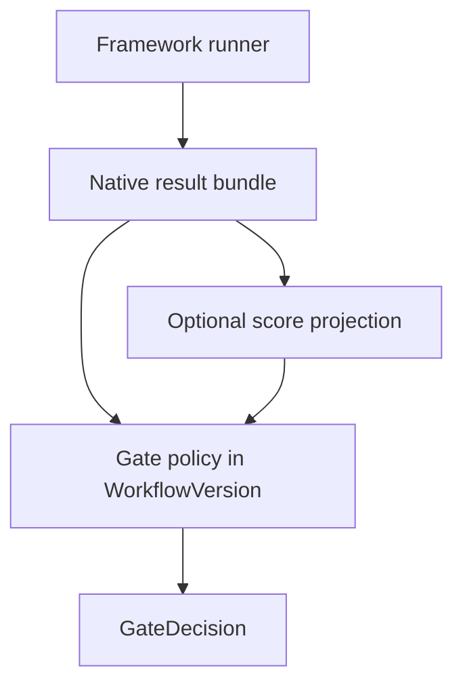

# Scores and gates

**Native results are authoritative; scores are optional projections; gates are workflow views.** Softprobe does not re-implement framework assertions to produce scores.

## Framework-reported facts

The framework runner emits a **native result bundle**. Softprobe may optionally **project** selected framework-reported measurements into thelake `scores` for query:

- name (e.g. `router.skill_match`)
- value (boolean, number, string, …)
- target (see [Score targets](/en/evaluation/reference/score-targets))
- runner / workflow identity + evidence references
- optional cost, latency, token usage

Projection is **lossy by design**. Unsupported fields stay in the native bundle and never block execution merely because Softprobe does not model them.

## What is not a score

| Outcome | Meaning |
|---------|---------|
| `missing_evidence` | Required artifact absent — **not** score 0 |
| `runner_error` | Runner crashed or failed — **not** low quality |
| `unsupported` | Capability not available on this host |
| `subject_error` | Subject failed before the framework finished |

See [Result status](/en/evaluation/reference/result-status).

## Gates (views)

A **gate policy** (pinned into **WorkflowVersion**) applies to:

1. outer lifecycle / FrameworkAttempt status,
2. declared provenance (definition digest, runner digest, …),
3. optionally **explicitly selected** runner-reported or projected fields.

```yaml
# Conceptual gate policy routing-v2
rules:
  - field: framework_attempt.status
    op: eq
    value: succeeded
  - field: native.summary.pass_rate   # selected runner-reported field
    op: gte
    threshold: 0.95
```

**GateDecision** records pass/fail + reasons for that policy version.

Re-evaluating an old WorkflowRun with a newer gate policy recomputes the decision; underlying native artifacts and projected measurements stay unchanged.

## Framework pass/fail flags

Promptfoo cell pass/fail (and similar) remain in the **native result bundle**. Softprobe may project them for convenience. They are **not** automatically Softprobe release gates — a gate policy must select them explicitly.

## Score target v2

Projected measurements attach to one canonical target:

`span | trace | session | workflow_run | framework_attempt`

Legacy span/trace/session columns remain populated for v1 API compatibility.

## Diagram



## Related

- [Mental model](/en/evaluation/mental-model)
- [Data model](/en/evaluation/concepts/data-model)
- [Result status](/en/evaluation/reference/result-status)
