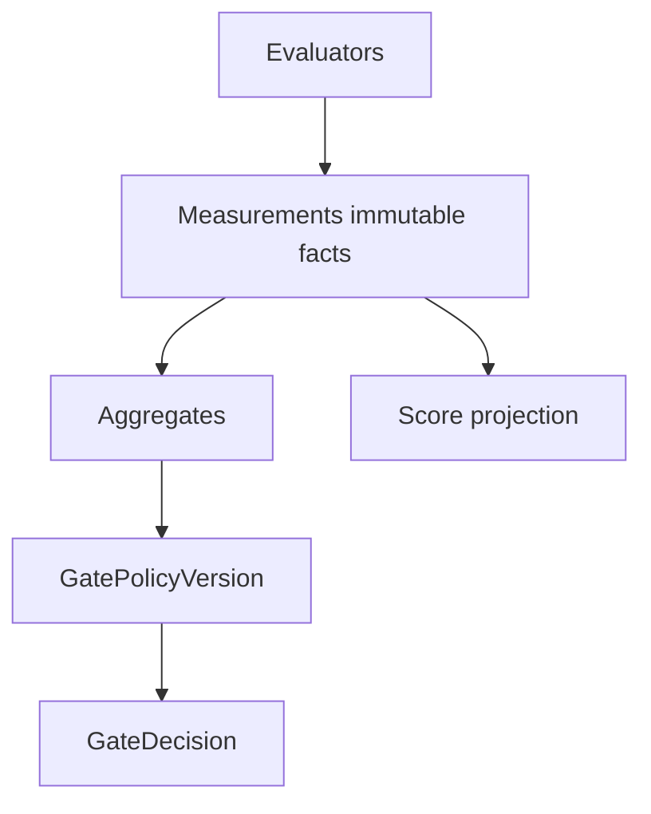

# Scores and gates

**Scores are facts; gates are views.** This separation keeps history honest and lets you change release policy without rewriting measurements.

## Measurements (facts)

Evaluators emit **measurements** — typed values with:

- name (`routing.skill_match`, `diagnosis.root_cause_correct`)
- value (boolean, number, string, …)
- target (see [Score targets](/en/evaluation/reference/score-targets))
- evaluator version + evidence references
- optional uncertainty, cost, latency, token usage

Measurements append to the eval ledger and **project** to thelake **scores** for querying.

## What is not a measurement

| Outcome | Meaning |
|---------|---------|
| `missing_evidence` | Grader could not find required inputs — **not** score 0 |
| `evaluator_error` | Judge crashed or timed out — **not** low quality |
| `unsupported` | Capability not available on this host |

See [Result status](/en/evaluation/reference/result-status).

## GatePolicyVersion (views)

A **gate** applies a versioned policy to measurements and aggregates:

```yaml
# Conceptual gate policy routing-v2
rules:
  - measurement: routing.skill_match
    op: all
    threshold: true
  - measurement: confidentiality.no_internal_storage
    op: all
    threshold: true
  - aggregate: routing.pass_rate
    op: gte
    threshold: 0.95
```

**GateDecision** records pass/fail + reasons at run time for policy version `routing-v2`.

Re-evaluating an old run with `routing-v3` recomputes the decision; underlying measurements unchanged.

## Framework pass/fail flags

Promptfoo cell pass/fail may be imported as a **measurement** or diagnostic artifact. It is **not** the authoritative release gate — the kernel recomputes gates from its own measurements.

## Score target v2

Measurements attach to one canonical target:

`span | trace | session | rollout | case_run | run | comparison_group`

Legacy span/trace/session columns remain populated for v1 API compatibility.

## Diagram


