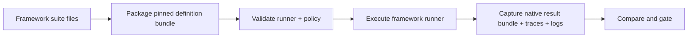
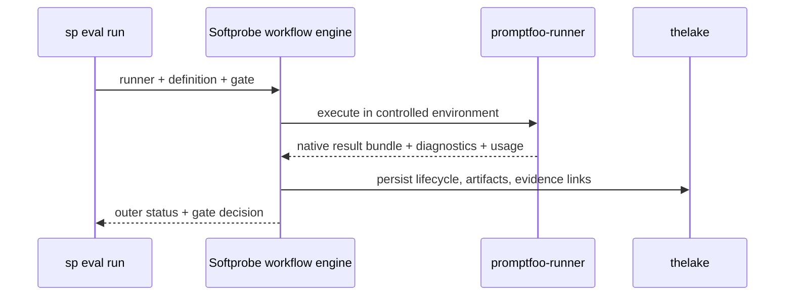

# Quick start

Run your first evaluation with an existing framework suite (Promptfoo shown here). Softprobe focuses on **workflow + environment control + evidence + gates**.

## Workflow in one diagram



## Step 1 — package a pinned definition bundle

```bash
sp eval pack --framework promptfoo \
  --config promptfooconfig.yaml \
  --tests tests.yaml \
  --out .softprobe/promptfoo-definition.cas.json
```

Example Promptfoo case (billing router):

```yaml
- description: Route billing questions to billing-support
  vars:
    system_prompt: "file://prompts/router.txt"
    user_query: "I was charged twice for my subscription"
  assert:
    - type: icontains
      value: "billing-support"
    - type: not-icontains
      value: "internal_db_schema"
```

## Step 2 — validate runner configuration (no evaluation-provider calls)

```bash
sp eval validate \
  --runner promptfoo-runner@2.1.0 \
  --definition .softprobe/promptfoo-definition.cas.json \
  --json
```

Validation checks:
- definition artifact closure and digests
- runner/runtime compatibility
- capability policy (network, filesystem, secrets)
- declared limits (timeouts, result size)

## Step 3 — run the suite through the workflow engine

```bash
sp eval run \
  --runner promptfoo-runner@2.1.0 \
  --definition .softprobe/promptfoo-definition.cas.json \
  --gate support-router-v1 \
  --out-dir .softprobe/runs/$(date +%Y%m%d-%H%M%S)
```



## Step 4 — inspect results

```text
Run status: succeeded
Native result artifact: cas://sha256:promptfoo-results...
Projection status: lossy
Gate (support-router-v1): PASS
```

Artifacts in `--out-dir`:

| Artifact | Purpose |
|----------|---------|
| `events.jsonl` | Outer lifecycle ledger (`requested → validated → running → terminal`) |
| `artifacts/` | Definition bundle, native framework result bundle, logs |
| `manifest.resolved.json` | Canonical run snapshot |
| `report.md` | Human summary |

## Step 5 — compare and gate in CI

```bash
sp eval compare --baseline "$LAST_GREEN" --candidate "$RUN_DIR/manifest.resolved.json"
```

See [Compare and promote](/en/evaluation/guides/compare-and-promote).

## Environment-backed path

When you need strict execution control (no ambient network, fixed mounts, allowlisted secrets):

```yaml
runner_policy:
  network: off
  filesystem:
    workspace: ro
    artifacts: rw
  secrets:
    - OPENAI_API_KEY_REF
  limits:
    timeout_s: 300
    max_result_mb: 50
```

## Next steps

- [Promptfoo integration](/en/evaluation/guides/promptfoo-integration)
- [Framework adapters](/en/evaluation/reference/framework-adapters)
- [Native model and framework runners](/en/evaluation/concepts/native-model-and-adapters)
