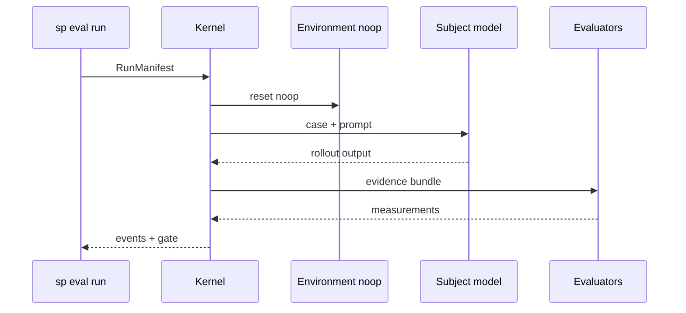

# Quick start

Run your first agent evaluation in about ten minutes using the **native suite format** — framework-agnostic YAML that compiles to a **RunManifest**. Optional Promptfoo import is covered at the end.

## Prerequisites

- **Softprobe CLI** (`sp`) — [Testing installation](/en/testing/installation/)
- **sp-eval-kernel** on `PATH` (bundled with CLI)

## Overview


## Step 1 — Author a native suite

Create `suites/support-router-v1.yaml`:

```yaml
cases:
  - id: billing_double_charge
    title: Route billing questions to billing-support
    input:
      user_query: "I was charged twice for my subscription"
    input_refs:
      prompt: file://prompts/router.txt

subject:
  provider: openai:gpt-4o
  temperature: 0
  prompt_ref: file://prompts/router.txt

environment:
  type: noop

evaluators:
  - id: router.skill_match
    capability: builtin/deterministic/contains@1
    params:
      pattern: billing-support
      selector: rollout.output
  - id: confidentiality.no_internal_terms
    capability: builtin/deterministic/not-contains@1
    params:
      pattern: internal_db_schema
      selector: rollout.output

gate: support-router-v1
```

This is the **product model**: cases, subject, **environment**, evaluators by **capability** — not a translation layer from another tool.

Compile (no model cost):

```bash
sp eval validate --suite suites/support-router-v1.yaml --out .softprobe/manifest.json
```

## Step 2 — Inspect the manifest

Validation resolves file refs to digests and produces a portable **RunManifest**:

```json
{
  "suite_version_id": "suite_v1_abc123…",
  "cases": [{
    "case_version_id": "case_billing_double_charge_…",
    "input": { "user_query": "I was charged twice for my subscription" },
    "input_refs": { "prompt_digest": "sha256:router.txt…" }
  }],
  "subject_version_id": "subj_openai_gpt4o_router_…",
  "environment_version_id": "env_noop_v1",
  "evaluator_version_ids": [
    "eval_contains_router_skill_match_…",
    "eval_not_contains_confidentiality_…"
  ],
  "gate_policy_id": "gate_support_router_v1",
  "reproducibility": "pinned_external",
  "provenance": { "source": "native_suite", "path": "suites/support-router-v1.yaml" }
}
```

Evaluator **names** (`router.skill_match`) and **capabilities** (`builtin/deterministic/contains@1`) are stable across runs. You do not encode Promptfoo `assert[].type` in the manifest.

See [Native model and adapters](/en/evaluation/concepts/native-model-and-adapters).

## Step 3 — Run locally

```bash
sp eval run \
  --manifest .softprobe/manifest.json \
  --gate support-router-v1 \
  --out-dir .softprobe/runs/$(date +%Y%m%d-%H%M%S)
```



Output in `--out-dir`:

| Artifact | Purpose |
|----------|---------|
| `events.jsonl` | Append-only event ledger |
| `manifest.resolved.json` | Fully resolved run snapshot |
| `report.md` | Human-readable summary |
| `junit.xml` | CI integration |
| `artifacts/` | Content-addressed evidence |

## Step 4 — Read results

```text
Case: billing_double_charge — Route billing questions to billing-support
  router.skill_match = true
  confidentiality.no_internal_terms = true
  status = succeeded
Gate (support-router-v1): PASS
```

Each measurement links to evidence artifacts and evaluator version digests.

## Step 5 — Gate in CI

```bash
sp eval run --manifest .softprobe/manifest.json --gate support-router-v1 --out-dir "$RUN_DIR"
sp eval compare --baseline "$LAST_GREEN" --candidate "$RUN_DIR/manifest.resolved.json"
```

See [Run locally and in CI](/en/evaluation/guides/run-locally-and-ci).

## Step 6 — Upgrade to environment-backed eval

When you move from output checks to a full agent, change **environment** and **evaluators** — not the workflow:

```yaml
environment:
  type: fixture
  ref: oci://billing-sandbox@sha256:…
  verify: integration_tests

subject:
  ref: oci://support-agent@sha256:…

evaluators:
  - id: task.tests_pass
    capability: builtin/environment/outcome@1
  - id: agent.tool_policy
    capability: builtin/trajectory/tools@1
```

See [Prompt-only vs environment eval](/en/evaluation/guides/eval-modes).

## Optional — import existing Promptfoo YAML

If you already have `tests.yaml`, use an adapter — **do not** treat the import output as the long-term authoring format:

```bash
sp eval validate --import promptfoo \
  --config promptfooconfig.yaml --tests tests.yaml \
  --out .softprobe/manifest.json --json
```

The adapter maps a **supported subset** and reports `unsupported` / `lossy_mapping` for everything else. Migrate important cases to native suites over time.

See [Framework adapters](/en/evaluation/reference/framework-adapters).

## Mock / offline runs

```bash
sp eval run --manifest .softprobe/manifest.json \
  --subject fixture:mock-router --out-dir .softprobe/runs/mock
```

## Next steps

| Goal | Page |
|------|------|
| Why native vs adapters | [Native model and adapters](/en/evaluation/concepts/native-model-and-adapters) |
| Entity reference | [Data model](/en/evaluation/concepts/data-model) |
| Authoring guide | [Author a suite](/en/evaluation/guides/author-a-suite) |
| Promptfoo coexistence | [Promptfoo integration](/en/evaluation/guides/promptfoo-integration) |
