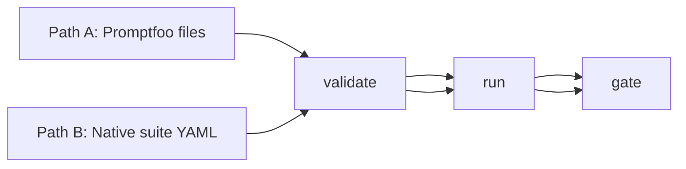
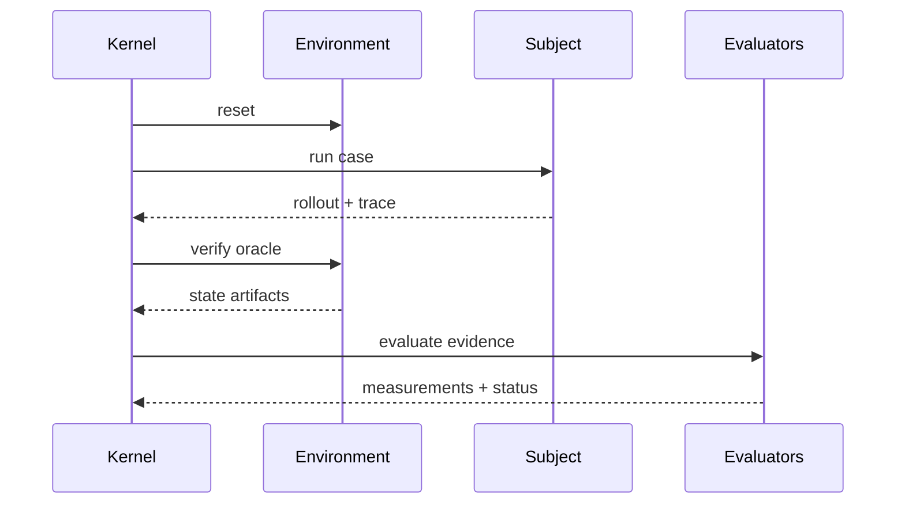

# Quick start

Start with one of two real paths:

1. **You already have Promptfoo** → run it through a pinned framework runner.
2. **You are starting fresh** → author a native suite.

Both paths end in the same workflow: **validate → run → evidence → gate**.



## Path A (recommended for existing Promptfoo teams)

### Step A1 — package definition bundle

```bash
sp eval pack --framework promptfoo \
  --config promptfooconfig.yaml --tests tests.yaml \
  --out .softprobe/promptfoo-definition.cas.json
```

### Step A2 — validate runner configuration (no model calls)

```bash
sp eval validate \
  --runner promptfoo-runner@2.1.0 \
  --definition .softprobe/promptfoo-definition.cas.json \
  --json
```

### Step A3 — execute via kernel-managed runner

```bash
sp eval run \
  --runner promptfoo-runner@2.1.0 \
  --definition .softprobe/promptfoo-definition.cas.json \
  --gate support-router-v1 \
  --out-dir .softprobe/runs/$(date +%Y%m%d-%H%M%S)
```

### Step A4 — read output

```text
Run status: succeeded
Native result artifact: cas://sha256:promptfoo-results...
Projection status: lossy
Gate (support-router-v1): PASS
```

## Path B (native suite authoring)

Create `suites/support-router-v1.yaml`:

```yaml
cases:
  - id: billing_double_charge
    input:
      user_query: "I was charged twice for my subscription"
    input_refs:
      prompt: file://prompts/router.txt
subject:
  provider: openai:gpt-4o
  prompt_ref: file://prompts/router.txt
environment:
  type: noop
evaluators:
  - id: router.skill_match
    capability: builtin/deterministic/contains@1
    params: { pattern: billing-support, selector: rollout.output }
gate: support-router-v1
```

Validate and run:

```bash
sp eval validate --suite suites/support-router-v1.yaml --out .softprobe/manifest.json
sp eval run --manifest .softprobe/manifest.json --gate support-router-v1 --out-dir .softprobe/runs/latest
```

## Environment-backed upgrade example

Move from prompt-only to oracle-backed checks without changing workflow:

```yaml
environment:
  type: fixture
  ref: oci://billing-sandbox@sha256:...
  verify: integration_tests

evaluators:
  - id: task.tests_pass
    capability: builtin/environment/outcome@1
```



## Where artifacts go

| File | Meaning |
|------|---------|
| `events.jsonl` | Append-only lifecycle ledger |
| `artifacts/` | Definition bundle, native result bundle, evidence blobs |
| `manifest.resolved.json` | Canonical run snapshot |
| `report.md` | Human summary |

## Next steps

- [Native model and framework runners](/en/evaluation/concepts/native-model-and-adapters)
- [Promptfoo integration](/en/evaluation/guides/promptfoo-integration)
- [Author a suite](/en/evaluation/guides/author-a-suite)
