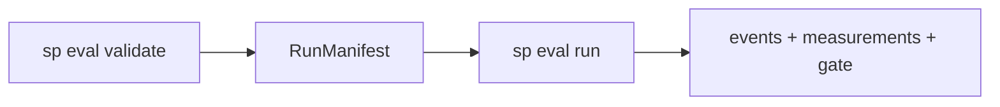
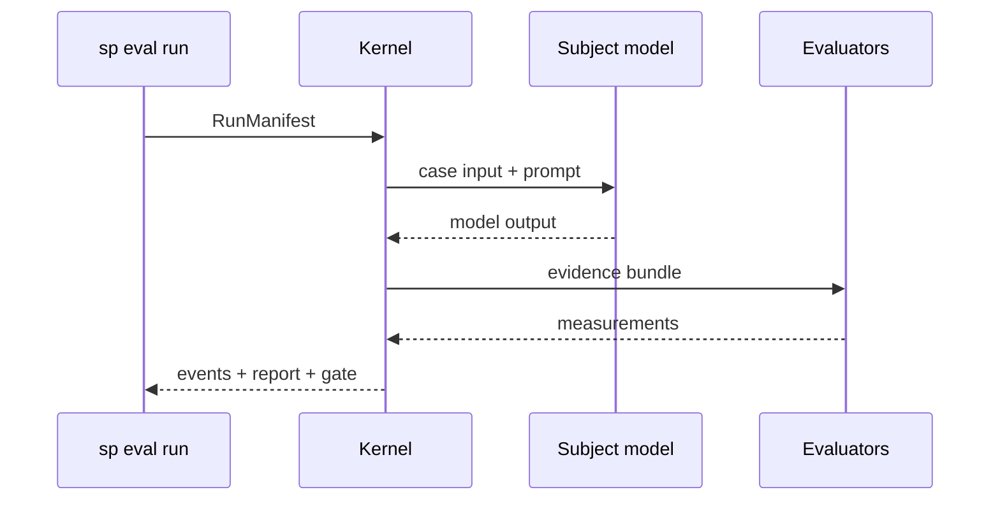

# Quick start

This guide runs your first agent evaluation in about ten minutes: define a Promptfoo-style suite, validate it, run locally, and read results.

## Prerequisites

- **Softprobe CLI** (`sp`) installed — see [Testing installation](/en/testing/installation/)
- **sp-eval-kernel** available on `PATH` (bundled with Softprobe CLI or installed separately)
- A Promptfoo-style config (or use the inline example below)

## Overview



## Step 1 — Author or import a suite

Define cases in YAML (Promptfoo-compatible) or via SDK/API:

```bash
sp eval validate --import promptfoo \
  --config promptfooconfig.yaml \
  --tests tests.yaml \
  --out .softprobe/manifest.json
```

Example `tests.yaml` row (customer support **router**):

```yaml
- description: Route billing questions to billing-support skill
  vars:
    system_prompt: "file://prompts/router.txt"
    user_query: "I was charged twice for my subscription"
  assert:
    - type: icontains
      value: "billing-support"
    - type: not-icontains
      value: "internal_db_schema"
```

`validate` compiles to a canonical **RunManifest**, emits stable IDs, and returns typed diagnostics for unsupported assertions — **without calling a model**.

::: tip
Run `sp eval validate` in CI as a non-gating check while migrating; gate on `sp eval run` once parity is proven.
:::

## Step 2 — Inspect the manifest

The manifest pins every behavior-affecting input by digest:

```json
{
  "suite_version_id": "suite_v1_abc123…",
  "cases": [{
    "case_version_id": "case_billing_double_charge_…",
    "input": { "user_query": "I was charged twice for my subscription" }
  }],
  "subject": {
    "prompt_digest": "sha256:router.txt…",
    "provider": "openai:gpt-4o",
    "temperature": 0
  },
  "evaluators": [
    { "name": "router.skill_match", "type": "contains", "value": "billing-support" },
    { "name": "confidentiality.no_internal_terms", "type": "not-contains", "value": "internal_db_schema" }
  ],
  "environment": { "type": "noop" },
  "reproducibility": "pinned_external"
}
```

See [Data model](/en/evaluation/concepts/data-model) for field definitions.

## Step 3 — Run locally

```bash
sp eval run \
  --manifest .softprobe/manifest.json \
  --out-dir .softprobe/runs/$(date +%Y%m%d-%H%M%S)
```



The kernel:

1. Plans the execution DAG
2. Executes the **subject** (pinned model + prompt)
3. Materializes **evidence**
4. Runs **evaluators**
5. Emits **events** and writes artifacts

Output in `--out-dir`:

| Artifact | Purpose |
|----------|---------|
| `events.jsonl` | Append-only event ledger |
| `manifest.resolved.json` | Fully resolved run snapshot |
| `report.md` | Human-readable summary |
| `junit.xml` | CI integration |
| `artifacts/` | Content-addressed evidence blobs |

## Step 4 — Read results

Each case run produces **measurements** (facts) and optionally a **gate decision** (policy view):

```text
Case: Route billing questions to billing-support
  router.skill_match = true
  confidentiality.no_internal_terms = true
  status = succeeded
Gate (router-v1): PASS
```

Drill into any measurement to see evaluator version, evidence refs, and linked trace IDs.

## Step 5 — Compare and gate in CI

Pin the suite digest in your workflow and fail the job on gate regression:

```bash
sp eval run --manifest .softprobe/manifest.json --gate router-v1 --out-dir "$RUN_DIR"
sp eval compare --baseline "$LAST_GREEN_MANIFEST" --candidate "$RUN_DIR/manifest.resolved.json"
```

See [Run locally and in CI](/en/evaluation/guides/run-locally-and-ci).

## Mock / offline runs

For fork-safe CI without provider credentials, use a deterministic subject fixture:

```bash
sp eval run --manifest .softprobe/manifest.json --subject fixture:mock-router --out-dir .softprobe/runs/mock
```

The fixture exercises kernel plumbing; it is not a substitute for live provider parity testing on trusted branches.

## Next steps

| Goal | Page |
|------|------|
| Understand entities | [Data model](/en/evaluation/concepts/data-model) |
| Prompt-only vs full agent harness | [Eval modes](/en/evaluation/guides/eval-modes) |
| Keep using Promptfoo | [Promptfoo integration](/en/evaluation/guides/promptfoo-integration) |
| REST automation | [API reference](/en/evaluation/reference/api) |
| AI agent hosts | [For AI agents](/en/evaluation/agents/overview) |
