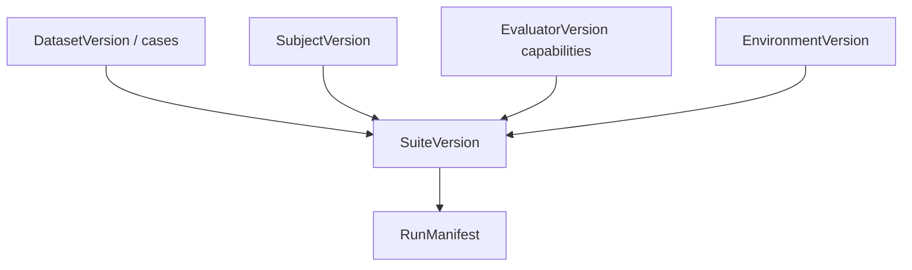

# Author a suite

Define evaluation with four ingredients — **framework-agnostic**, compiled to RunManifest:

```text
data + subject + evaluators + environment
```



## Example — complete native suite

` suites/support-router-v1.yaml`:

```yaml
cases:
  - id: billing_double_charge
    title: Route billing questions to billing-support
    input:
      user_query: "I was charged twice for my subscription"
    input_refs:
      prompt: file://prompts/router.txt
  - id: technical_api_error
    title: Route API errors to technical-support
    input:
      user_query: "Our checkout API returns 503 intermittently"
    input_refs:
      prompt: file://prompts/router.txt

subject:
  provider: openai:gpt-4o
  temperature: 0
  prompt_ref: file://prompts/router.txt

environment:
  type: noop

evaluators:
  - id: router.skill_match
    capability: builtin/deterministic/contains@1
    params:
      pattern: "{{case.expected_skill}}"   # per-case override in case metadata
      selector: rollout.output
  - id: confidentiality.no_internal_terms
    capability: builtin/deterministic/not-contains@1
    params:
      pattern: internal_db_schema
      selector: rollout.output

trials:
  count: 1

gate: support-router-v1
```

Per-case skill expectation (example metadata on case 1):

```yaml
  - id: billing_double_charge
    metadata:
      expected_skill: billing-support
```

Compile: `sp eval validate --suite suites/support-router-v1.yaml --out .softprobe/manifest.json`

## Data (cases)

Each **case** includes:

- **input** — user query, task spec, media refs
- **input_refs** — content-addressed prompt/files
- **metadata** — category, difficulty, expected_skill
- **lineage** — `derived_from` trace or prod snapshot (optional)
- **split** — `development`, `regression`, `held_out_release`

Cases do **not** store stale model outputs.

## Subject

| Eval mode | Example |
|-----------|---------|
| Prompt-only | `provider: openai:gpt-4o` + `prompt_ref: file://prompts/router.txt` |
| Full agent | `ref: oci://support-agent@sha256:…` + tool config |

Pin every behavior-affecting digest.

## Evaluators (capabilities)

Reference evaluators by **capability id**, not framework assert types:

```yaml
evaluators:
  - id: task.tests_pass
    capability: builtin/environment/outcome@1
    params: { oracle: integration_tests }
  - id: support.grounded
    capability: plugin/llm-judge@3
    params:
      rubric_ref: file://rubrics/groundedness.txt
      model: openai:gpt-4o
      selector: rollout.output
```

See [Evaluator taxonomy](/en/evaluation/evaluators/) and [Capability descriptors](/en/evaluation/reference/capability-descriptors).

## Environment

| Type | Example | When |
|------|---------|------|
| `noop` | `type: noop` | Prompt-only output checks |
| `fixture` | `ref: oci://billing-sandbox@sha256:…` | Agent with stubbed APIs + verify |
| `sandbox` | Stateful harness + `reset`/`step`/`verify` | Multi-turn tasks |

**Example — sandbox upgrade:**

```yaml
environment:
  type: fixture
  ref: oci://billing-sandbox@sha256:def456…
  verify: integration_tests
```

See [Prompt-only vs environment eval](/en/evaluation/guides/eval-modes).

## SDK example

```python
from softprobe.eval import Suite, dataset, subject, evaluators, environment

suite = Suite(
    data=dataset.from_yaml("suites/support-router-v1.yaml"),
    subject=subject.provider("openai:gpt-4o", prompt="prompts/router.txt"),
    environment=environment.noop(),
    evaluators=[
        evaluators.contains("router.skill_match", "billing-support"),
        evaluators.not_contains("confidentiality.no_internal_terms", "internal_db_schema"),
    ],
    gate="support-router-v1",
)
manifest = suite.validate()
run = suite.run(output=".softprobe/runs/latest")
```

## REST equivalent

`POST /api/v1/eval/compile` with the four fields → **RunManifest**.

## Optional — Promptfoo import

Use `--import promptfoo` only for migration; rewrite to native YAML for cases you gate on. See [Framework adapters](/en/evaluation/reference/framework-adapters).

## Related

- [Native model and adapters](/en/evaluation/concepts/native-model-and-adapters)
- [Quick start](/en/evaluation/getting-started)
