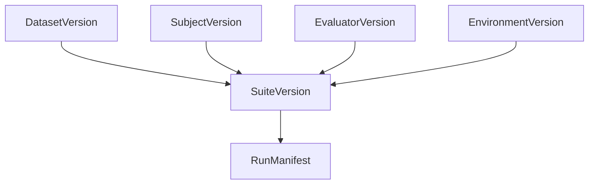

# Author a suite

Define evaluation with four ingredients:

```text
data + subject + evaluators + environment
```



## Data (DatasetVersion / cases)

Each **case** includes:

- Input (user query, task spec, media refs)
- Optional expected references (gold answer, rubric ref)
- Metadata (category, difficulty)
- Lineage (`derived_from` trace or prod snapshot)
- Split label (`development`, `regression`, …)

Cases do **not** store stale model outputs.

## Subject

The **system under test**:

| Eval mode | Subject example |
|-----------|-----------------|
| Prompt-only | Router prompt digest + pinned LLM provider |
| Full agent | Container/binary digest + tool config + model |

Pin every behavior-affecting digest: prompts, tools, dependency locks, image tags.

## Evaluators

List scorer versions by reference or inline descriptor:

- Deterministic (`contains`, `regex`, JSON Schema)
- LLM judges (pinned model + rubric digest)
- Trajectory assertions (tool order, span selectors)
- Environment verifiers (tests pass, oracle state)

## Environment

| Type | When |
|------|------|
| `noop` | Prompt-only eval (output text checks) |
| `fixture` | Agent episode with stubbed APIs |
| `sandbox` | Stateful tasks (Terminal-Bench-style) |

See [Prompt-only vs environment eval](/en/evaluation/guides/eval-modes).

## SDK example (conceptual)

```python
from softprobe.eval import Suite, dataset, subject, evaluators, environment

suite = Suite(
    data=dataset.pin("sha256:…"),
    subject=subject.pin("oci://support-agent@sha256:…"),
    environment=environment.pin("fixture:billing-sandbox"),
    evaluators=[router_skill_match, confidentiality, outcome_verifier],
    trials=TrialPolicy(count=3, seed=42),
    gate="router-v1",
)
suite.validate()  # compile manifest, no model cost
run = suite.run(output=".softprobe/runs/latest")
```

## REST equivalent

`POST /api/v1/eval/compile` with the same four fields → returns a resolved **RunManifest** for `sp eval run` or `POST /api/v1/eval/runs` (managed host).

See [API reference](/en/evaluation/reference/api).
