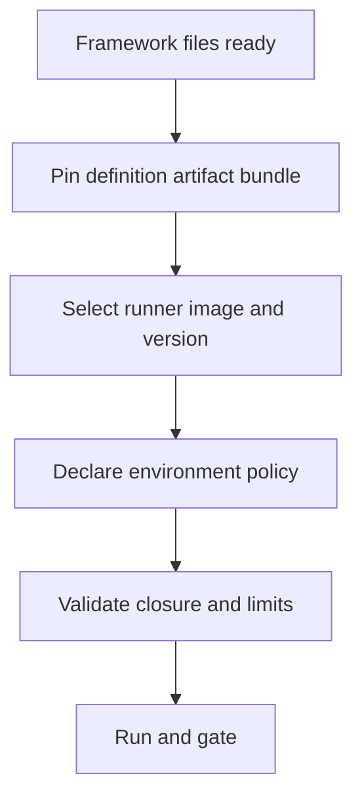

# Prepare a framework run

This guide replaces "author a suite". You keep using your framework's suite DSL (Promptfoo, DeepEval, etc.) and prepare it for reproducible workflow execution.

## Preparation checklist



## 1) Keep framework-native definitions

Example Promptfoo files:

- `promptfooconfig.yaml`
- `tests.yaml`
- `prompts/router.txt`

Do not rewrite these into a new Softprobe DSL.

## 2) Package the definition bundle

```bash
sp eval pack --framework promptfoo \
  --config promptfooconfig.yaml \
  --tests tests.yaml \
  --out .softprobe/promptfoo-definition.cas.json
```

The bundle should contain all resolved files by digest.

## 3) Declare runner + environment policy

```yaml
workflow:
  framework_definition: .softprobe/promptfoo-definition.cas.json
  runner:
    id: promptfoo-runner@2.1.0
    runtime_image: ghcr.io/softprobe/promptfoo-runner@sha256:9c3...
  subject: support-router@sha256:...
  environment:
    network: off
    filesystem:
      workspace: ro
      artifacts: rw
    secrets:
      - OPENAI_API_KEY_REF
    limits:
      timeout_s: 300
      max_result_mb: 50
  gate_policy: support-router-v1
```

## 4) Validate before run

```bash
sp eval validate \
  --runner promptfoo-runner@2.1.0 \
  --definition .softprobe/promptfoo-definition.cas.json \
  --json
```

Typical validation failures:
- unpinned file reference
- disallowed network capability
- missing secret reference
- oversized declared result budget

## 5) Execute and collect results

```bash
sp eval run \
  --runner promptfoo-runner@2.1.0 \
  --definition .softprobe/promptfoo-definition.cas.json \
  --gate support-router-v1 \
  --out-dir .softprobe/runs/latest
```

## Result structure

| Output | Meaning |
|--------|---------|
| Native framework result bundle | Full framework semantics and diagnostics |
| Outer run lifecycle events | Cross-framework workflow state |
| Optional projected measurements | Query convenience, explicitly loss-aware |
| Gate decision | Release policy output |

## Example governance rule

```yaml
gate: support-router-v1
rules:
  - run_status == succeeded
  - native_result_present == true
  - projected.router_skill_match == true
```

## Related

- [Quick start](/en/evaluation/getting-started)
- [Promptfoo integration](/en/evaluation/guides/promptfoo-integration)
- [Framework runners](/en/evaluation/reference/framework-adapters)
