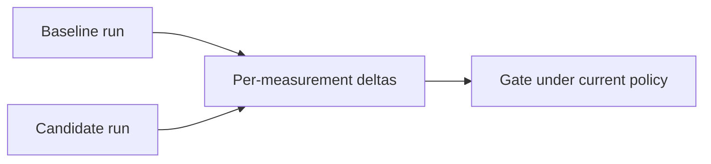

# Compare and promote

## Compare runs

```bash
sp eval compare \
  --baseline .softprobe/runs/main-green/manifest.resolved.json \
  --candidate .softprobe/runs/pr-123/manifest.resolved.json \
  --json
```



Returns per-measurement deltas, aggregate changes, and gate outcomes under current policies. Stochastic suites include uncertainty intervals when trials > 1.

## Compare subjects

Run the **same SuiteVersion** against two **SubjectVersion** digests (e.g. agent build A vs B) with paired trial seeds for fair paired tests.

## Promote

`sp eval promote` records an authorized decision to use a suite/gate combination for release tracking — with audit lineage to RunManifest and GatePolicyVersion digests.

Promotion is distinct from gate pass on a single run; it may require human approval in governed workflows.

## Release gate example (prompt-only router)

```yaml
gate: support-router-v1
rules:
  - all_cases: router.skill_match == true
  - all_cases: confidentiality.no_internal_terms == true
  - aggregate: pass_rate >= 1.0
```

Environment-backed suites add outcome and tool-policy measurements — see [Eval modes](/en/evaluation/guides/eval-modes) and [Environment outcome](/en/evaluation/evaluators/environment-outcome).
