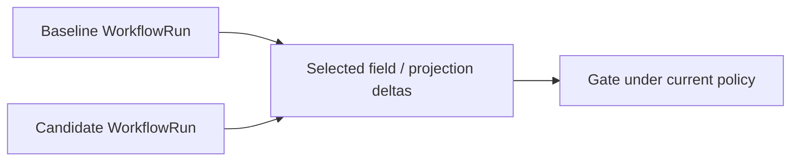

# Compare and promote

## Compare runs

```bash
sp eval compare \
  --baseline .softprobe/runs/main-green/workflow.resolved.json \
  --candidate .softprobe/runs/pr-123/workflow.resolved.json \
  --json
```



Returns deltas on selected projected measurements and/or runner-reported summary fields, plus GateDecision under current policies. Stochastic **framework** suites may include uncertainty in the native bundle; Softprobe surfaces what was projected.

## Compare subjects

Run the **same WorkflowVersion** (same FrameworkDefinition + RunnerVersion + EnvironmentVersion + gate policy) against two **SubjectVersion** digests (e.g. agent build A vs B).

## Promote

`sp eval promote` records an authorized decision to use a workflow/gate combination for release tracking — with audit lineage to WorkflowVersion and gate-policy digests.

Promotion is distinct from gate pass on a single run; it may require human approval in governed workflows.

## Release gate example (prompt-only router)

```yaml
gate: support-router-v1
rules:
  - field: framework_attempt.status
    op: eq
    value: succeeded
  - field: native.summary.failedCount
    op: eq
    value: 0
```

Environment-backed suites typically select additional runner-reported outcome fields — see [Eval modes](/en/evaluation/guides/eval-modes) and [Environment outcome](/en/evaluation/evaluators/environment-outcome).
