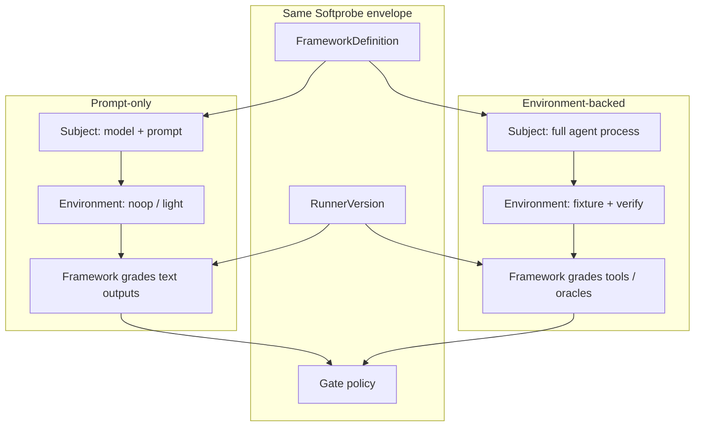
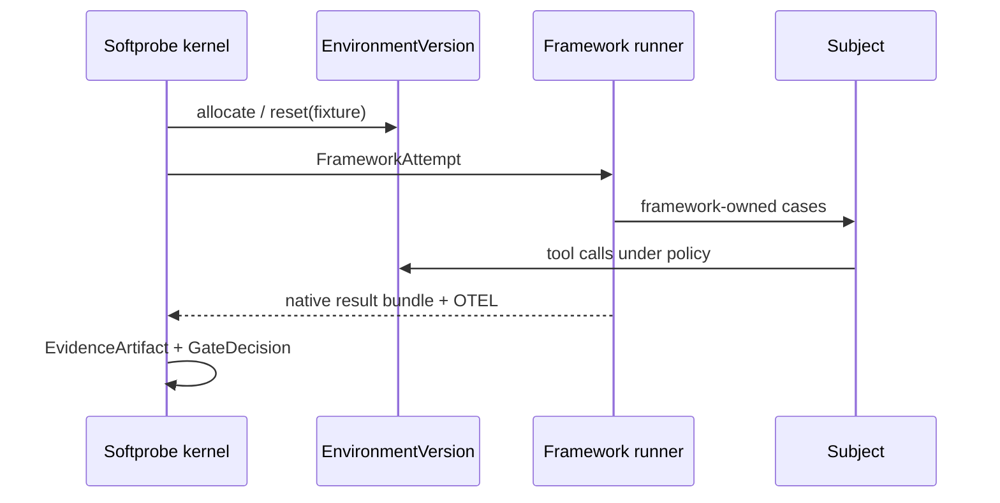

# Prompt-only vs environment eval

Most teams start with **prompt-only** evaluation (model output checks). Mature agent programs add **environment-backed** evaluation (outcome oracles in a harness). Both use the same Softprobe workflow envelope — only **SubjectVersion** and **EnvironmentVersion** change. Assertions stay in the **framework** suite.



## Prompt-only eval

Use when the agent is a **single model call** (or short chain) and graders inspect **output text**.

| Piece | Typical choice |
|-------|----------------|
| **SubjectVersion** | Pinned model + system prompt digest |
| **EnvironmentVersion** | `noop` — no harness |
| **Framework checks** | Promptfoo `icontains` / confidentiality asserts, etc. |

**Customer example:** a support **router** that must name the correct department and never leak internal schema names.

```yaml
vars:
  system_prompt: "file://prompts/router.txt"
  user_query: "I was charged twice for my subscription"
assert:
  - type: icontains
    value: "billing-support"
  - type: not-icontains
    value: "internal_db_schema"
```

**What it proves:** routing policy and safety strings — not whether downstream tools run correctly.

## Environment-backed eval

Use when the **agent is a process** (tools, multi-turn, code execution) and you can define **oracles**: tests pass, API state, task completion.

| Piece | Typical choice |
|-------|----------------|
| **SubjectVersion** | Agent binary/image digest + tool config |
| **EnvironmentVersion** | Fixture repo, stubbed APIs, reset/step/verify |
| **Framework checks** | Outcome asserts, trajectory metrics, LLM judges — still in-framework |



**What it proves:** **outcomes beat transcripts** — a plausible answer that fails the oracle is still a failure.

## Choosing a mode

| Question | Prompt-only | Environment-backed |
|----------|-------------|-------------------|
| Is the SUT one model call? | Yes | Often no |
| Do you have a reliable oracle? | No | Yes |
| Cost / setup time | Low | Higher |
| Catches tool misuse? | Limited | Yes |
| CI without secrets | Easy (fixtures) | Needs harness images |

Many programs run **both**: prompt-only gates for fast PR checks; environment suites nightly or on release candidates.

## Same workflow, different digests

```text
WorkflowVersion
  ├── FrameworkDefinition     # Promptfoo/DeepEval suite (mode-specific asserts)
  ├── RunnerVersion
  ├── SubjectVersion          # ← changes between modes
  ├── EnvironmentVersion      # ← noop vs fixture
  └── gate policy
```

Compare WorkflowRuns with `sp eval compare` when SubjectVersion digests change.

## Related

- [Prepare a framework run](/en/evaluation/guides/author-a-suite)
- [Environment outcome](/en/evaluation/evaluators/environment-outcome)
- [Evidence and trajectories](/en/evaluation/concepts/evidence-and-trajectories)
- [Environment bundles and dependency tapes](/en/evaluation/concepts/environment-bundles)
- [Record and replay an agent environment](/en/evaluation/guides/record-replay-agent-environment)
- [Gym episodes and training rollouts](/en/evaluation/guides/gym-and-training-rollouts)
