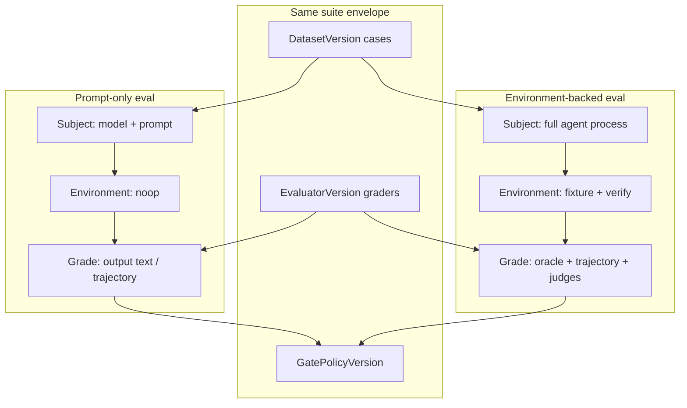
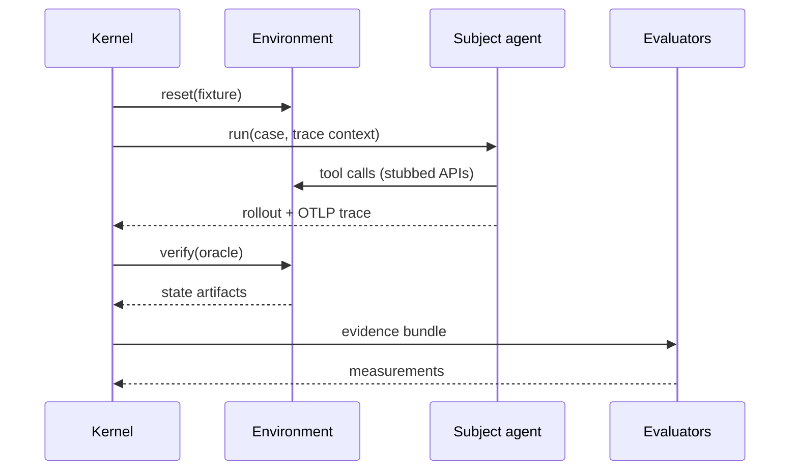

# Prompt-only vs environment eval

Most teams start with **prompt-only** evaluation (model output checks). Mature agent programs add **environment-backed** evaluation (outcome oracles in a harness). Both use the same suite envelope — only the subject and environment versions change.



## Prompt-only eval

Use when the agent is a **single model call** (or short chain) and graders inspect **output text** or a lightweight trajectory.

| Piece | Typical choice |
|-------|----------------|
| **SubjectVersion** | Pinned model + system prompt digest |
| **EnvironmentVersion** | `noop` — no harness |
| **Evaluators** | Deterministic contains/regex, LLM rubric, confidentiality scanners |

**Customer example:** a support **router** that must name the correct department (`billing-support`, `technical-support`) and never leak internal schema names.

```yaml
vars:
  system_prompt: "file://prompts/router.txt"
  user_query: "I was charged twice for my subscription"
assert:
  - type: icontains
    value: "billing-support"
  - type: not-icontains
    value: "internal_db_schema"
```

**What it proves:** routing policy and safety strings — not whether downstream tools run correctly.

## Environment-backed eval

Use when the **agent is a process** (tools, multi-turn, code execution) and you can define **oracles**: tests pass, API state, task completion.

| Piece | Typical choice |
|-------|----------------|
| **SubjectVersion** | Agent binary/image digest + tool config |
| **EnvironmentVersion** | Fixture repo, stubbed APIs, `reset` / `step` / `verify` |
| **Evaluators** | Environment outcome, trajectory/tool policy, LLM judges |

**Customer example:** a **coding or ops agent** that must fix a failing integration test in a sandbox repo — success = tests green + allowed tools only.



**What it proves:** **outcomes beat transcripts** — a plausible answer that fails the oracle is still a failure.

## Choosing a mode

| Question | Prompt-only | Environment-backed |
|----------|-------------|-------------------|
| Is the SUT one model call? | Yes | Often no |
| Do you have a reliable oracle? | No | Yes |
| Cost / setup time | Low | Higher |
| Catches tool misuse? | Limited | Yes |
| CI without secrets | Easy (fixtures) | Needs harness images |

Many programs run **both** on the same product: prompt-only gates for fast PR checks; environment suites nightly or on release candidates.

## Same manifest, different digests

```text
SuiteVersion
  ├── CaseVersion[]           # shared or split datasets
  ├── SubjectVersion          # ← changes between modes
  ├── EnvironmentVersion      # ← noop vs fixture
  ├── EvaluatorVersion[]      # ← output checks vs oracles
  └── GatePolicyVersion
```

Compare runs with `sp eval compare` using paired trial seeds when subject versions change.

## Related

- [Author a suite](/en/evaluation/guides/author-a-suite)
- [Environment outcome evaluators](/en/evaluation/evaluators/environment-outcome)
- [Evidence and trajectories](/en/evaluation/concepts/evidence-and-trajectories)
