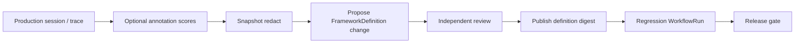

# Production-to-eval loop

Turn real failures into **immutable framework-native regression artifacts** with governance — not silent copy-paste from production into a Softprobe DSL.

## Steps

1. **Observe** — Online policy or manual selection identifies a failed production **trace** (or **session**)
2. **Annotate** (optional) — Humans attach **scores** to the relevant **observation** (**span**); see [Annotation](/en/evaluation/concepts/annotation)
3. **Snapshot** — Capture evidence with consent, redaction, sensitivity tags
4. **Propose** — Candidate **FrameworkDefinition** (or runner/env/gate) change with `derived_from` lineage — still framework-native files
5. **Review** — Human or independent policy approves exact digests
6. **Publish** — Immutable FrameworkDefinition joins the regression pack
7. **Activate** — WorkflowVersion / gate references updated in an authorized action
8. **Gate** — Next agent build must pass the expanded workflow

## Authorization

| Action | Who |
|--------|-----|
| Propose | Humans, AI agents (with audit) |
| Approve / publish / activate gate | Configured human or policy — **not** self-approval by proposing agent |
| Rollback | Server RBAC with immutable audit |

Approval binds exact content digest; any mutation invalidates it.

## Relationship to Testing

Java record/replay cases in [Testing](/en/testing/) remain separate. Eval artifacts may **reference** trace IDs as lineage without merging replay mock semantics into eval workflows.

See [Evaluation loop](/en/evaluation/concepts/evaluation-loop).
